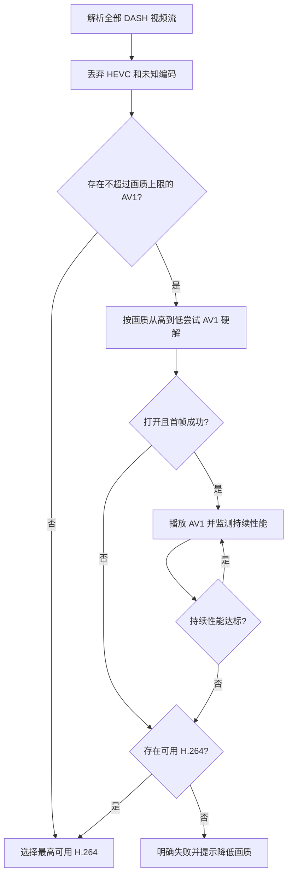

# H.264 + AV1 视频解码迁移方案

## 目标与边界

将当前随 Mod 分发的 FFmpeg 视频能力从 H.264 + HEVC 调整为 H.264 + AV1：

- 默认优先 AV1 硬件解码；
- AV1 硬解不可用时，优先降低画质继续寻找可硬解的 AV1；
- 再回退到不超过用户画质上限的 H.264；
- 当前发布包不包含 AV1 软件解码；只有未来引入 dav1d/libaom 后，才按安全预算启用；
- 构建、请求、选择和解码路径均不再包含 HEVC；
- 保留 H.264 作为旧视频、旧硬件和 B站编码覆盖不足时的兼容后端。

本方案只覆盖点播 DASH 视频。直播音频、普通音频、E-AC-3、FLAC、AAC 和 MP3 链路不因本次迁移改变。音频 playurl 请求所需的 `fnval` 必须独立维护，不能与视频请求共用常量。

## 已确认事实

### B站 DASH 请求与编码标识

BAC 文档给出的相关 `fnval` 位为：

| 位值 | 含义 |
| ---: | --- |
| 16 | 请求 DASH |
| 2048 | 请求 AV1 编码 |

普通画质视频请求的基础值为：

$$
16 \mathbin{\mathrm{OR}} 2048 = 2064
$$

即基础值 `fnval=2064`。4K 和 8K 还需要按用户画质上限加入 BAC 文档规定的功能位，不能固定使用 2064：

| 画质上限 | 位组合 | `fnval` | 其他参数 |
| --- | --- | ---: | --- |
| 低于 4K | DASH \| AV1 | 2064 | 常规 `qn`，`fourk=0` 或兼容性保留 1 |
| 4K | DASH \| 4K \| AV1 | 2192 | `qn=120`，`fourk=1` |
| 8K | DASH \| 4K \| 8K \| AV1 | 3216 | `qn=127`，`fourk=1` |

其中 $2192=16\,|\,128\,|\,2048$，$3216=16\,|\,128\,|\,1024\,|\,2048$。8K 是否严格依赖同时携带 4K 位应以真实接口回归测试确认；在确认前保守携带 128，以免服务端裁剪高分辨率候选。

当前代码使用的 `fnval=4048` 已包含 AV1，但也请求 HDR、杜比视界等更多 DASH 特性，其中部分画质只提供 HEVC。迁移后必须通过命名常量按画质上限构造最小位掩码，并继续在响应端拒绝 HEVC。不得为取得 4K/8K 而重新加入 HDR 64 或杜比视界 512。

响应中的编码 ID：

| `codecid` | 编码 | 迁移后处理 |
| ---: | --- | --- |
| 7 | H.264/AVC | 兼容回退 |
| 12 | HEVC/H.265 | 丢弃，不进入候选集 |
| 13 | AV1 | 默认首选 |

`fnval` 只决定服务端返回哪些能力候选，不能保证只返回 AV1。客户端必须解析完整的 `data.dash.video[]`，按 `codecid` 选择，并以 `codecs` 字符串交叉校验：AV1 应为 `av01.*`，H.264 应为 `avc1.*`。编码 ID 与 codec string 冲突时丢弃并记录诊断日志。

### 高画质限制

- 8K 不提供 H.264，不能假定同画质存在 AVC 回退；
- AV1 8K 硬解失败不代表设备完全不支持 AV1，可能只是超过硬件最大分辨率、Level、位深或 surface 预算；
- 用户选择的画质继续解释为最高画质上限，而不是必须命中该档位；
- AV1 高画质硬解失败后应先尝试较低画质 AV1 硬解，再寻找较低画质 H.264；
- 当前所有 AV1 软件解码候选均应禁用；未来引入软件 decoder 后仍默认禁止 4K/8K 软件解码。

### 专利与许可证边界

- 移除 HEVC 是本次迁移的主要专利降险动作；
- 只要二进制仍包含 H.264 decoder，默认较少使用 H.264 不会消除产品具备 H.264 解码能力这一事实；
- AV1 按 AOMedia Patent License 1.0 获得来自许可人的附条件免版税专利许可，但不能宣传为全球绝对零专利风险；
- 二进制分发 AV1 实现时，在 JAR 的法律声明中附带 AOMedia Patent License 1.0；
- 继续满足 FFmpeg LGPL v2.1+ 的动态链接、精确对应源码、修改补丁、构建说明和许可证随包要求；
- 第一阶段使用 FFmpeg 内置 AV1 decoder 连接各平台硬件后端，不引入 `libaom` 或 `dav1d`。该内置 decoder 在没有 hwaccel 时会返回 `ENOSYS`，不提供原生软件解码；未来需要软件 AV1 时优先评估 dav1d，并补充其 BSD 许可证与跨平台构建审计。

## 目标播放决策

### 默认模式 `auto`

默认策略是“AV1 硬解优先，失败后回退 H.264”。当前 native bundle 没有 AV1 软件 decoder。



候选优先级：

1. 不超过用户画质上限的最高 AV1，硬件解码；
2. 较低画质 AV1，硬件解码；
3. 不超过用户画质上限的最高 H.264；
4. 没有可用 H.264 时失败。未来引入 dav1d/libaom 后，才能追加受预算限制的 AV1 软件候选。

为避免连续初始化多个相邻档位造成黑屏，单次播放最多进行三个 AV1 硬解探测：

1. 用户上限内最高 AV1；
2. 不超过 4K 的最高 AV1；
3. 不超过 1080P 的最高 AV1。

如果这些条件命中同一条流，应去重。成功或决定回退 H.264 后，不再探测更多 AV1。

### 可配置模式

| 模式 | 行为 |
| --- | --- |
| `auto` | AV1 硬解优先；失败后回退 H.264；默认值 |
| `prefer-av1` | AV1 硬解优先；当前仍不启用不存在的软件 AV1 backend |
| `compatibility` | 仅在 AV1 硬解可用时使用 AV1，否则直接 H.264 |
| `h264` | 只选 H.264，用于故障排查和老设备 |

所有模式均拒绝 HEVC。高级配置不能重新启用未随包构建的 HEVC。

## 候选模型

当前 `getBestVideoStream()` 只返回一条 `VideoStream`，无法在 AV1 首帧失败后无网络重取地切换 H.264。迁移后引入一次响应内的候选计划，例如：

```text
VideoStreamPlan
  requestedQualityCeiling
  hardwareAv1Candidates[]
  h264Candidates[]
  softwareAv1Candidates[]
  diagnostics
```

每条 `VideoStream` 继续保存：

- quality、codecId、codecs；
- width、height、frameRate；
- base URL 与排序后的 CDN candidates；
- initialization/index range；
- 可选的 bit depth、profile、level（能从 codec string 或 `av1C` 稳妥解析时填写）。

候选计划必须来自同一次 WBI playurl 响应。发生回退时直接切换已保存的候选，不重新签名、不重新请求 API。只有所有候选 URL 过期或均返回鉴权错误时，才刷新 playurl。

候选排序必须是纯函数，以便无 Minecraft 运行时地单元测试。禁止使用 `codecId=0` 表示“任意编码”的回退；该行为可能重新选中 HEVC。

## 硬件能力与失败语义

### 不以 `hwaccel=auto` 代表硬解成功

`auto` 只是请求。必须查询 native decoder 的 actual backend：

- `d3d11va`、`dxva2`、`vaapi`、`videotoolbox` 等表示实际硬件路径；
- `cpu`、`none` 或明确的 fallback reason 表示软件路径；
- `unknown-old-native` 不得当作硬解成功。

AV1 decoder open API 需要区分：

- 要求硬解且失败，不允许在同一 handle 中静默回落 CPU；
- 显式软件解码（仅在未来集成 dav1d/libaom 后有效）；
- 普通 auto（仅供兼容或诊断，不用于候选决策）。

否则上层无法知道“AV1 硬解失败”还是“AV1 已经偷偷开始软解”。建议 native open 结果返回强类型状态或至少提供可稳定查询的 backend/fallback reason。

### 首帧预算

打开 decoder 不能证明当前 AV1 profile、extradata 和首个关键帧可解。AV1 硬解候选还需通过有限首帧探测：

- 读取初始化段和首个可解码样本；
- 最多等待 2 秒；
- 最多送入一个有限 packet 数量；
- 成功产出第一帧才提交为当前播放后端；
- 失败时关闭 decoder、frame、packet、hardware frames context 和输入流，再尝试下一候选。

具体 packet 上限在实现阶段以测试样本确定，并作为命名常量或高级 JVM 属性暴露。时间与 packet 两个预算任一先到即失败。

### 持续性能预算

目标帧率的单帧时间预算为：

$$
T_{frame}=\frac{1000}{FPS}\ \text{ms}
$$

前 5 秒作为预热观测窗口，至少记录：

- decoder backend；
- 平均和高分位解码耗时；
- 实际解码 FPS；
- 帧队列饥饿次数；
- 丢帧比例；
- 音视频时间差；
- native frame/surface 数量与内存峰值。

若实际解码 FPS 持续低于目标的 80%，或时间差持续扩大，则当前会话回退一次。回退后锁定新后端，禁止 AV1/H.264 来回切换。阈值应集中在独立策略类中，不散落于 renderer、decoder 和 UI。

### 软件 AV1 默认上限（未来能力）

`media-min-v37` 不包含 dav1d/libaom；FFmpeg 内置 `av1` decoder 在无
hwaccel 时返回 `ENOSYS`。因此以下预算当前不得生成实际播放候选，只保留为
未来引入软件 decoder 后的策略设计：

第一版采用保守默认值：

| 分辨率/帧率 | 默认策略 |
| --- | --- |
| ≤ 720p60 | 可尝试软件 AV1 |
| ≤ 1080p30 | 可尝试软件 AV1 |
| 1080p60 | `auto` 默认回退 H.264；`prefer-av1` 可探测 |
| 1440p | 默认回退 H.264 |
| 4K/8K | 禁止自动软件 AV1 |

这些是安全策略，不是宣称所有硬件的固定性能。后续应以真实客户端基准调整，并允许高级用户覆盖；覆盖值必须有硬上限，防止无界 frame 分配。

## fMP4 与 AV1 数据路径

AV1 不能直接复用 H.264/HEVC 的 NAL-to-Annex-B 处理：

- H.264/HEVC 使用 `avcC`/`hvcC`、长度前缀 NAL unit 和 Annex-B 起始码；
- AV1 使用 `av01` VisualSampleEntry、`av1C` AV1CodecConfigurationBox 和 OBU；
- `Fmp4NativeVideoDecoder` 当前把非 HEVC codec 强制归为 H.264，并对 sample 统一执行长度前缀 NAL 转换；AV1 接入前必须消除此默认回落。

迁移后：

1. 定义强类型 codec 或至少显式常量 `7/13`，未知 ID 构造时立即失败；
2. MP4 box walker 识别 `av01` 和 `av1C`；
3. 解析 `av1C` 所需的 marker/version/profile/level/tier/bit-depth/chroma 字段与 config OBUs；
4. 明确 FFmpeg AV1 decoder 接收 packet 时是否需要将 config OBUs 作为 `AVCodecContext.extradata`，而不是拼到每个媒体 packet；
5. AV1 sample 保持 OBU 语义，不进入 `toAnnexB(...)`；
6. seek、首帧、关键帧和 PTS reorder 使用现有通用时间线，但增加真实 AV1 fMP4 样本测试。

实现前应以一段 B站 AV1 m4s 初始化段和媒体段建立冻结测试夹具。不得仅用人工构造的最小 box 证明真实流可播。

## FFmpeg 与 JNI 改造

### FFmpeg 构建

从 `build_media.sh` 和 `.github/workflows/build.yml` 删除：

- `--enable-decoder=hevc`；
- `--enable-parser=hevc`；
- `--enable-bsf=hevc_mp4toannexb`；
- 所有 `hevc_*` hwaccel 配置。

加入：

- `--enable-decoder=av1`；
- AV1 parser 或实际 fMP4 packet 路径所需组件；
- 各平台经验证可用的 AV1 hwaccel。

CI 必须检查最终 `config.h`：

- `CONFIG_AV1_DECODER=1`；
- `CONFIG_H264_DECODER=1`；
- `CONFIG_HEVC_DECODER=0`；
- 不存在外部 `libaom`/`dav1d` 依赖；
- 保持未启用 `--enable-gpl` 和 `--enable-nonfree`。

同时审计导出符号、动态依赖、架构、macOS install name/code signature 和 Windows runtime，沿用现有六平台发布门槛。

### JNI codec 映射

`video_jni.c` 的 codec switch 调整为：

| B站 ID | FFmpeg ID |
| ---: | --- |
| 7 | `AV_CODEC_ID_H264` |
| 13 | `AV_CODEC_ID_AV1` |

ID 12 和未知 ID 必须抛出“不支持的 codecId”，不能默认回落 H.264。错误文本、诊断和 JavaDoc 删除 H.264/HEVC 专属描述。

硬解探测应返回：

- requested backend；
- actual backend；
- fallback reason；
- decoder codec；
- 必要时包括硬件像素格式和 transfer 是否发生。

### 输出格式

AV1 优先复用现有 NV12/YUV shader 路径。不要为了快速接入只实现 RGBA 回读，否则 GPU→CPU transfer、swscale 和 Java→GPU 上传可能掩盖硬解收益。

首阶段最低要求：

- 8-bit 4:2:0 AV1 输出可进入 NV12 路径；
- 10-bit 流若当前纹理链不支持，应在候选阶段判为不兼容并回退，而不是截断位深；
- RGBA 仅作为诊断或明确的兼容 fallback，并记录实际 copy/convert 路径。

## Java 侧改造触点

### `BiliApiClient`

- 视频 `fnval` 改为命名位组合：普通画质 2064、4K 2192、8K 3216；
- 音频 `fnval` 保持独立，不做全局字符串替换；
- 解析所有 AV1/H.264 流并丢弃 HEVC；
- 删除 `exact-any-codec` 和 `fallback-any-*`；
- 返回 `VideoStreamPlan`，而不是只返回一条 URL；
- 日志输出所有候选的画质、codec、尺寸、帧率、host 和淘汰原因。

### `Fmp4NativeVideoDecoder`

- 支持 codec ID 13；
- 未知 codec 不再默认为 H.264；
- 增加 `av01`/`av1C` box 支持；
- 将 H.264 NAL 转换与 AV1 OBU packet 路径分离；
- 保持 range seek、SegmentBase、PTS 和 frame pool 的公共逻辑；
- 提供首帧探测结果与清理完整性测试。

### `VideoNativeDecoder` / `VideoJni`

- JavaDoc 和参数校验改为 H.264/AV1；
- 暴露“硬解必须成功”和“显式软件”打开模式；
- actual backend 为 CPU 时不得报告硬解成功；
- codec open、首帧和持续性能失败应使用可分类错误，不解析异常字符串。

### 播放协调层

- 一个会话持有一个 `VideoStreamPlan` 和至多一个已提交 decoder；
- 探测 decoder 在提交前属于临时资源，失败必须立即关闭；
- 回退保持当前媒体时间，通过目标候选的 SegmentBase/range seek 定位，不从 0 秒重播；
- 每个会话最多发生一次持续性能回退；
- session cancellation 同时取消当前输入、探测任务、decoder 和候选 CDN 请求。

### 配置与 UI

- 增加 codec 策略 `auto/prefer-av1/compatibility/h264`；
- UI 显示“请求画质”和“实际画质/codec/backend”；
- 降级提示区分：无 AV1 流、AV1 硬解不可用、profile 不兼容、性能回退、无 H.264 候选；
- 不向普通用户暴露 HEVC 选项；
- 高级日志记录 fallback reason，但不持续刷屏。

## 分阶段实施

> 实施状态（当前工作区）：Java 请求、候选、首帧回退和 AV1 fMP4 基础路径已实现并通过干净全量测试；FFmpeg/JNI 已由 GitHub Actions 生成 `media-min-v37` 六平台产物，归档 SHA-256、路径结构和 LGPL 文件均已核验，六个平台目录已作为一个整体替换。v37 在 Linux x86_64/ARM64 启用了 H.264 与 AV1 VAAPI。当前 AV1 仅支持硬解，不包含 dav1d/libaom 软件 decoder。后续仍需完成目标平台动态加载及真实 B站 AV1/设备矩阵验证。

### 阶段 1：纯 Java 候选选择

- [x] 定义 codec 常量/枚举和 `VideoStreamPlan`；
- [x] 视频请求按画质上限使用 2064/2192/3216；
- [x] 从响应中严格过滤 HEVC；
- [x] 实现确定性 AV1/H.264 候选排序；
- [ ] 用冻结 JSON 覆盖 8K 无 H.264、同档多 codec、无 AV1、只有 HEVC、特殊画质等情况。

完成标准：尚未启用 AV1 decoder 时，选择层已能给出正确候选计划，且永远不返回 codec ID 12。

### 阶段 2：FFmpeg/JNI AV1 基础解码

- [x] 构建配置从 HEVC 改为 AV1；
- [x] JNI 映射 13 → `AV_CODEC_ID_AV1`，拒绝 12/未知值；
- [x] 六个平台 GitHub Actions 构建产物已发布且归档校验通过；
- [x] Windows x86_64 DLL 依赖闭包可加载，关键视频 JNI 导出存在；
- [ ] 六个平台动态加载与目标设备依赖审计通过；
- [ ] 引入 dav1d/libaom 后，native 单元/烟雾测试能用软件 decoder 解出冻结样本首帧。

完成标准：发布二进制不含 HEVC decoder，H.264 软件解码和 AV1 平台硬解可验证。

### 阶段 3：AV1 fMP4 接入

- [x] 支持 `av01`/`av1C` 基础解析；
- [x] 将 `av1C` config OBU 在首个 AV1 packet 前发送；
- [x] AV1 sample 不走 Annex-B；
- [ ] 真实 B站 AV1 m4s 可顺序播放和 range seek；
- [ ] PTS、B-frame/重排序语义和结束 flush 正确。

完成标准：平台硬解路径可稳定播放真实 AV1 DASH 样本，且 H.264 回归测试无变化。

### 阶段 4：硬解探测与回退

- [x] 各平台 AV1 hwaccel 已写入构建配置，actual backend 已由 JNI 暴露；
- [x] 实现最多三个代表性 AV1 硬解候选；
- [ ] 实现首帧双预算；
- [x] AV1 首帧失败后无需刷新 playurl 即可切换 H.264；
- [x] 候选回退沿用当前媒体偏移和 session 身份。

完成标准：无 AV1 硬解、仅低分辨率 AV1 硬解、8K AV1 失败、H.264 缺失等路径均有确定结果。

### 阶段 5：性能保护与发布合规

- [ ] 引入软件 AV1 decoder 后启用并验证默认分辨率/帧率上限；
- [x] NV12 低复制路径可供 AV1 复用；
- [ ] 内存、surface、帧队列和回退清理诊断通过；
- [x] 源资源附带 AOMedia Patent License 1.0 与第三方声明；
- [x] 补齐 FFmpeg LGPL、精确源码、修改补丁、构建说明和发布校验和；
- [ ] 下载页面说明 H.264/AV1 能力和第三方许可证。

完成标准：自动化、六平台构建和目标设备矩阵通过后，才发布当前 native bundle。

## 测试矩阵

### 纯 Java 自动化

- 普通、4K、8K 的视频 `fnval` 分别为 2064/2192/3216，音频请求不受影响；
- 同画质 AV1/H.264/HEVC 混合时只保留 13/7，并优先 13；
- 8K 只有 AV1、1080P 有 H.264 时，计划包含 8K AV1 硬解候选和 1080P H.264 回退；
- 8K AV1、4K AV1、1080P H.264 时，硬解候选顺序正确且去重；
- 只有 HEVC 时明确失败，不走任意 codec；
- 未知 codec ID 和 codec string 冲突时拒绝；
- 特殊画质过滤与用户画质上限语义保持正确；
- CDN 候选和 SegmentBase 在 AV1/H.264 间互不串流。

### native 与格式测试

- H.264 `avcC` 回归；
- AV1 `av01`/`av1C` 解析；
- 截断/畸形 `av1C` 安全失败；
- AV1 config OBU、媒体 OBU、flush 和 PTS；
- 8-bit NV12 输出；
- 不支持的 10-bit/色度格式明确失败；
- codec ID 12 和未知 ID 无法打开；
- decoder、packet、frame、hw context 在每个失败点均无泄漏。

### 客户端集成设备

至少覆盖：

- 支持 AV1 硬解的新 NVIDIA/Intel/AMD 或 Apple 设备；
- 不支持 AV1 硬解但支持 H.264 的旧设备；
- AV1 硬解只支持较低最大分辨率的设备；
- 驱动禁用/远程桌面导致硬解创建失败；
- 1080p30、1080p60、4K、8K 样本；
- AV1 首帧损坏、CDN 失败、URL 过期、播放中 seek 和会话取消。

每次集成测试记录实际 backend、源尺寸/帧率、输出格式、平均解码耗时、帧队列、丢帧、音画差、native 内存和 GPU surface。没有测量数据时不宣称 AV1 与 H.264 在特定硬件上的性能比例。

## 发布门槛

以下条件全部满足后才能发布新 native bundle：

- [x] Release 构建配置对 HEVC decoder/parser/bsf 为 0 进行强制断言，并只启用 H.264/AV1 hwaccel；
- [x] API 响应中的 HEVC 永远不会进入候选计划；
- [x] AV1 不会被错误送入 H.264 Annex-B 路径；
- [x] AV1 硬解成功以 actual backend 为准；
- [x] 8K/4K AV1 不会自动落入无界软件解码；
- [x] AV1 失败可在同一次 playurl 响应内回退 H.264；
- [ ] 回退不重置时间线、不串 session、不泄漏 native/GPU 资源；
- [x] Java 干净全量测试通过，H.264 候选、seek、NV12/RGBA 与 CDN 代码路径完成编译回归；
- [ ] 六个平台 native 构建、加载、符号和架构审计通过；
- [ ] AOMedia 与 FFmpeg 法律材料已随 JAR 和下载页面提供。

## 非目标

本次迁移不承诺：

- 所有设备均可硬解 AV1；
- 所有 B站视频和画质均有 AV1；
- 用户选择 8K 时必须输出 8K；
- 软件 AV1 在 4K/8K 下可用；
- AV1 完全不存在第三方专利主张；
- 第一阶段引入 dav1d、libaom 或新的编码能力。

实现应优先保证确定性回退、资源安全和可观测性，再逐步扩大 AV1 软件解码与硬件后端覆盖。