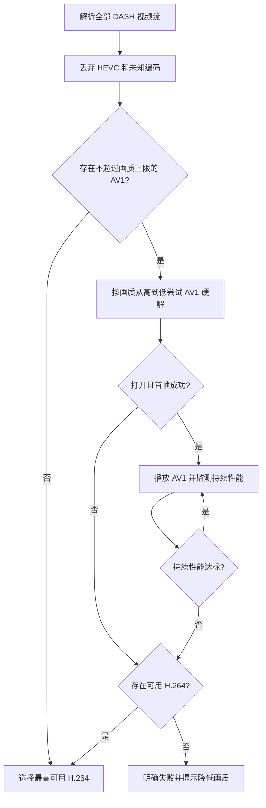

# H.264 + AV1 视频解码迁移方案

## 目标与边界

将当前随 Mod 分发的 FFmpeg 视频能力从 H.264 + HEVC 调整为 H.264 + AV1：

- 默认优先 AV1 硬件解码；
- AV1 硬解不可用时，优先降低画质继续寻找可硬解的 AV1；
- 再回退到不超过用户画质上限的 H.264；
- 当前发布包不包含、也不计划在本轮引入 AV1 软件解码；AV1 硬解失败时直接回退 H.264；
- 构建、请求、选择和解码路径均不再包含 HEVC；
- 保留 H.264 作为旧视频、旧硬件和 B站编码覆盖不足时的兼容后端。

本方案只覆盖点播 DASH 视频。直播音频、普通音频、E-AC-3、FLAC、AAC 和 MP3 链路不因本次迁移改变。音频 playurl 请求所需的 `fnval` 必须独立维护，不能与视频请求共用常量。

## 已确认事实

### B站 DASH 请求与编码标识

BAC 文档给出的相关 `fnval` 位为：

| 位值 | 含义 |
| ---: | --- |
| 16 | 请求 DASH |
| 2048 | 请求 AV1 编码 |

普通画质视频请求的基础值为：

$$
16 \mathbin{\mathrm{OR}} 2048 = 2064
$$

即基础值 `fnval=2064`。4K 和 8K 还需要按用户画质上限加入 BAC 文档规定的功能位，不能固定使用 2064：

| 画质上限 | 位组合 | `fnval` | 其他参数 |
| --- | --- | ---: | --- |
| 低于 4K | DASH \| AV1 | 2064 | 常规 `qn`，`fourk=0` 或兼容性保留 1 |
| 4K | DASH \| 4K \| AV1 | 2192 | `qn=120`，`fourk=1` |
| 8K | DASH \| 4K \| 8K \| AV1 | 3216 | `qn=127`，`fourk=1` |

其中 $2192=16\,|\,128\,|\,2048$，$3216=16\,|\,128\,|\,1024\,|\,2048$。8K 是否严格依赖同时携带 4K 位应以真实接口回归测试确认；在确认前保守携带 128，以免服务端裁剪高分辨率候选。

当前代码使用的 `fnval=4048` 已包含 AV1，但也请求 HDR、杜比视界等更多 DASH 特性，其中部分画质只提供 HEVC。迁移后必须通过命名常量按画质上限构造最小位掩码，并继续在响应端拒绝 HEVC。不得为取得 4K/8K 而重新加入 HDR 64 或杜比视界 512。

响应中的编码 ID：

| `codecid` | 编码 | 迁移后处理 |
| ---: | --- | --- |
| 7 | H.264/AVC | 兼容回退 |
| 12 | HEVC/H.265 | 丢弃，不进入候选集 |
| 13 | AV1 | 默认首选 |

`fnval` 只决定服务端返回哪些能力候选，不能保证只返回 AV1。客户端必须解析完整的 `data.dash.video[]`，按 `codecid` 选择，并以 `codecs` 字符串交叉校验：AV1 应为 `av01.*`，H.264 应为 `avc1.*`。编码 ID 与 codec string 冲突时丢弃并记录诊断日志。

### 高画质限制

- 8K 不提供 H.264，不能假定同画质存在 AVC 回退；
- AV1 8K 硬解失败不代表设备完全不支持 AV1，可能只是超过硬件最大分辨率、Level、位深或 surface 预算；
- 用户选择的画质继续解释为最高画质上限，而不是必须命中该档位；
- AV1 高画质硬解失败后应先尝试较低画质 AV1 硬解，再寻找较低画质 H.264；
- 当前所有 AV1 软件解码候选均应禁用；未来引入软件 decoder 后仍默认禁止 4K/8K 软件解码。

### 专利与许可证边界

- 移除 HEVC 是本次迁移的主要专利降险动作；
- 只要二进制仍包含 H.264 decoder，默认较少使用 H.264 不会消除产品具备 H.264 解码能力这一事实；
- AV1 按 AOMedia Patent License 1.0 获得来自许可人的附条件免版税专利许可，但不能宣传为全球绝对零专利风险；
- 二进制分发 AV1 实现时，在 JAR 的法律声明中附带 AOMedia Patent License 1.0；
- 继续满足 FFmpeg LGPL v2.1+ 的动态链接、精确对应源码、修改补丁、构建说明和许可证随包要求；
- 当前使用 FFmpeg 内置 AV1 decoder 连接各平台硬件后端，不引入 `libaom` 或 `dav1d`。该 decoder 在没有 hwaccel 时返回 `ENOSYS`，随后进入 H.264 候选；只有 B站不再提供足够的 H.264 兼容流或产品需求发生变化时，才重新评估软件 AV1、许可证与体积成本。

## 目标播放决策

### 默认模式 `auto`

默认策略是“AV1 硬解优先，失败后回退 H.264”。当前 native bundle 没有 AV1 软件 decoder。


```mermaid
flowchart TD
    A[解析全部 DASH 视频流] --> B[丢弃 HEVC 和未知编码]
    B --> C{存在不超过画质上限的 AV1?}
    C -- 否 --> H[选择最高可用 H.264]
    C -- 是 --> D[按画质从高到低尝试 AV1 硬解]
    D --> E{打开且首帧成功?}
    E -- 是 --> F[播放 AV1 并监测持续性能]
    E -- 否 --> G{存在可用 H.264?}
    G -- 是 --> H
    G -- 否 --> K[明确失败并提示降低画质]
    F --> L{持续性能达标?}
    L -- 是 --> F
    L -- 否 --> G
```

候选优先级：

1. 不超过用户画质上限的最高 AV1，硬件解码；
2. 较低画质 AV1，硬件解码；
3. 不超过用户画质上限的最高 H.264；
4. 没有可用 H.264 时明确失败；当前不会追加 AV1 软件候选。

为避免连续初始化多个相邻档位造成黑屏，单次播放最多进行三个 AV1 硬解探测：

1. 用户上限内最高 AV1；
2. 不超过 4K 的最高 AV1；
3. 不超过 1080P 的最高 AV1。

如果这些条件命中同一条流，应去重。成功或决定回退 H.264 后，不再探测更多 AV1。

### 可配置模式

| 模式 | 行为 |
| --- | --- |
| `auto` | 最多三条 AV1 硬解；失败后回退 H.264；默认值 |
| `prefer-av1` | AV1 硬解优先；失败后回退 H.264 |
| `compatibility` | 只探测一条最高 AV1 硬解，失败后直接 H.264；禁止软件 AV1 |
| `h264` | 只选 H.264，用于故障排查和老设备 |

所有模式均拒绝 HEVC。高级配置不能重新启用未随包构建的 HEVC。

## 候选模型

当前 `getBestVideoStream()` 只返回一条 `VideoStream`，无法在 AV1 首帧失败后无网络重取地切换 H.264。迁移后引入一次响应内的候选计划，例如：

```text
VideoStreamPlan
  requestedQualityCeiling
  hardwareAv1Candidates[]
  h264Candidates[]
  softwareAv1Candidates[]
  diagnostics
```

每条 `VideoStream` 继续保存：

- quality、codecId、codecs；
- width、height、frameRate；
- base URL 与排序后的 CDN candidates；
- initialization/index range；
- 可选的 bit depth、profile、level（能从 codec string 或 `av1C` 稳妥解析时填写）。

候选计划必须来自同一次 WBI playurl 响应。发生回退时直接切换已保存的候选，不重新签名、不重新请求 API。只有所有候选 URL 过期或均返回鉴权错误时，才刷新 playurl。

候选排序必须是纯函数，以便无 Minecraft 运行时地单元测试。禁止使用 `codecId=0` 表示“任意编码”的回退；该行为可能重新选中 HEVC。

## 硬件能力与失败语义

### 不以 `hwaccel=auto` 代表硬解成功

`auto` 只是请求。必须查询 native decoder 的 actual backend：

- `d3d11va`、`dxva2`、`vaapi`、`videotoolbox` 等表示实际硬件路径；
- `cpu`、`none` 或明确的 fallback reason 表示软件路径；
- `unknown-old-native` 不得当作硬解成功。

AV1 decoder open API 需要区分：

- 要求硬解且失败，不允许在同一 handle 中静默回落 CPU；
- 显式软件解码请求在当前 bundle 中必须明确拒绝；
- 普通 auto（仅供兼容或诊断，不用于候选决策）。

否则上层无法知道“AV1 硬解失败”还是“AV1 已经偷偷开始软解”。建议 native open 结果返回强类型状态或至少提供可稳定查询的 backend/fallback reason。

### 首帧预算

打开 decoder 不能证明当前 AV1 profile、extradata 和首个关键帧可解。AV1 硬解候选还需通过有限首帧探测：

- 读取初始化段和首个可解码样本；
- 最多等待 2 秒；
- 最多送入一个有限 packet 数量；
- 成功产出第一帧才提交为当前播放后端；
- 失败时关闭 decoder、frame、packet、hardware frames context 和输入流，再尝试下一候选。

具体 packet 上限在实现阶段以测试样本确定，并作为命名常量或高级 JVM 属性暴露。时间与 packet 两个预算任一先到即失败。

当前实现基线（2026-08-12）：

- 仅对 `codecId=13` 且 `DecodeMode.HARDWARE_REQUIRED` 的候选启用；H.264、直播、Bench 和未来显式软件
  AV1 路径保持原有等待语义；
- 默认时间预算为 `2000ms`，默认 packet 预算为 `256`；配置键分别为
  `ncpb.video.native.av1_first_frame_probe_timeout_ms` 和
  `ncpb.video.native.av1_first_frame_probe_max_packets`；
- packet 按成功送入 native 的媒体 sample 计数，首包附带的 config OBU 不单独计数；同一候选的流恢复不清零；
- 每个 packet 在紧邻 native send 前取得唯一 permit，send 成功后该 permit 一直覆盖到 receive 返回 EAGAIN；时间
  截止只会封住下一包，不会把已经获准的 native 调用追溯成越界发送；
- 第 256 个 packet 会完整 drain decoder。同包第一帧被 stale/invalid/队列拒绝时仍会检查后续帧；仅当整包到
  EAGAIN 仍未提交播放队列才失败，且绝不会发送第 257 个；
- frame 的 ready 时间在 native receive 返回时记录。截止前产出的帧可以在截止后被消费并提交，截止后产出的帧
  只关闭并继续 drain；
- `256` 以当前 3 秒 close-fragment、60fps 约 180 个 preroll sample 为兼容基线，并预留重排余量；仍需用
  冻结的真实 B站 1080p60/4K/seek 样本继续校准；
- `HARDWARE_REQUIRED` 同时校验实际 backend，只接受当前支持的
  `d3d11va/dxva2/cuda/qsv/videotoolbox/vaapi`，拒绝 `cpu/none/unknown` 和未识别名称；
- 首帧只有成功进入播放帧队列后才提交候选。失败候选必须先完成 `close()` 与 `native termination` 屏障，才允许
  打开下一候选；关闭超时进入 fail-closed/zombie 监督。手持端按 `PlaybackSourceId`、投影端按稳定 owner key
  继续保留跨 session/registry clear 的替换 gate，因此同一物理解码 owner 不会在旧 context 收敛前启动新 context；
  不同 owner 仍按设计允许并行。
- 关闭诊断的 required phase 在一次快照中确定，随后无条件用 `whenComplete` 注册对应 future；禁止在 phase 已加入
  后再次用 `isDone()` 决定是否注册，否则 worker 在两个检查之间退出会被误报为永久 pending。合法 MP4 `free`
  填充的冻结真实 AV1 场景已在 macOS ARM64 默认预算下连续 3 次通过该关闭门禁。

### 持续性能预算

目标帧率的单帧时间预算为：

$$
T_{frame}=\frac{1000}{FPS}\ \text{ms}
$$

前 5 秒作为预热观测窗口，至少记录：

- decoder backend；
- 平均和高分位解码耗时；
- 实际解码 FPS；
- 帧队列饥饿次数；
- 丢帧比例；
- 音视频时间差；
- native frame/surface 数量与内存峰值。

若实际解码 FPS 持续低于目标的 80%，或时间差持续扩大，则当前会话回退一次。回退后锁定新后端，禁止 AV1/H.264 来回切换。阈值应集中在独立策略类中，不散落于 renderer、decoder 和 UI。

### 软件 AV1 发布决策

`media-min-v48` 不包含 dav1d/libaom；FFmpeg 内置 `av1` decoder 在无硬件后端时返回 `ENOSYS`。
当前候选策略不会生成软件 AV1，所有画质在 AV1 硬解失败后均回退 H.264。历史版本中关于软件 AV1
分辨率预算和 dav1d 构建的记录只保留在交接文档中作为决策历史，不再属于当前发布待办。

## fMP4 与 AV1 数据路径

AV1 不能直接复用 H.264/HEVC 的 NAL-to-Annex-B 处理：

- H.264/HEVC 使用 `avcC`/`hvcC`、长度前缀 NAL unit 和 Annex-B 起始码；
- AV1 使用 `av01` VisualSampleEntry、`av1C` AV1CodecConfigurationBox 和 OBU；
- `Fmp4NativeVideoDecoder` 当前把非 HEVC codec 强制归为 H.264，并对 sample 统一执行长度前缀 NAL 转换；AV1 接入前必须消除此默认回落。

迁移后：

1. 定义强类型 codec 或至少显式常量 `7/13`，未知 ID 构造时立即失败；
2. MP4 box walker 识别 `av01` 和 `av1C`；
3. 解析 `av1C` 所需的 marker/version/profile/level/tier/bit-depth/chroma 字段与 config OBUs；
4. 明确 FFmpeg AV1 decoder 接收 packet 时是否需要将 config OBUs 作为 `AVCodecContext.extradata`，而不是拼到每个媒体 packet；
5. AV1 sample 保持 OBU 语义，不进入 `toAnnexB(...)`；
6. seek、首帧、关键帧和 PTS reorder 使用现有通用时间线，但增加真实 AV1 fMP4 样本测试。

实现前应以一段 B站 AV1 m4s 初始化段和媒体段建立冻结测试夹具。不得仅用人工构造的最小 box 证明真实流可播。

## FFmpeg 与 JNI 改造

### FFmpeg 构建

从 `build_media.sh` 和 `.github/workflows/build.yml` 删除：

- `--enable-decoder=hevc`；
- `--enable-parser=hevc`；
- `--enable-bsf=hevc_mp4toannexb`；
- 所有 `hevc_*` hwaccel 配置。

加入：

- `--enable-decoder=av1`；
- AV1 parser 或实际 fMP4 packet 路径所需组件；
- 各平台经验证可用的 AV1 hwaccel。

CI 必须检查最终 `config.h`：

- `CONFIG_AV1_DECODER=1`；
- `CONFIG_H264_DECODER=1`；
- `CONFIG_HEVC_DECODER=0`；
- 不存在外部 `libaom`/`dav1d` 依赖；
- 保持未启用 `--enable-gpl` 和 `--enable-nonfree`。

同时审计导出符号、动态依赖、架构、macOS install name/code signature 和 Windows runtime，沿用现有六平台发布门槛。

### JNI codec 映射

`video_jni.c` 的 codec switch 调整为：

| B站 ID | FFmpeg ID |
| ---: | --- |
| 7 | `AV_CODEC_ID_H264` |
| 13 | `AV_CODEC_ID_AV1` |

ID 12 和未知 ID 必须抛出“不支持的 codecId”，不能默认回落 H.264。错误文本、诊断和 JavaDoc 删除 H.264/HEVC 专属描述。

硬解探测应返回：

- requested backend；
- actual backend；
- fallback reason；
- decoder codec；
- 必要时包括硬件像素格式和 transfer 是否发生。

### 输出格式

AV1 优先复用现有 NV12/YUV shader 路径。不要为了快速接入只实现 RGBA 回读，否则 GPU→CPU transfer、swscale 和 Java→GPU 上传可能掩盖硬解收益。

首阶段最低要求：

- 8-bit 4:2:0 AV1 输出可进入 NV12 路径；
- 10-bit 流若当前纹理链不支持，应在候选阶段判为不兼容并回退，而不是截断位深；
- RGBA 仅作为诊断或明确的兼容 fallback，并记录实际 copy/convert 路径。

## Java 侧改造触点

### `BiliApiClient`

- 视频 `fnval` 改为命名位组合：普通画质 2064、4K 2192、8K 3216；
- 音频 `fnval` 保持独立，不做全局字符串替换；
- 解析所有 AV1/H.264 流并丢弃 HEVC；
- 删除 `exact-any-codec` 和 `fallback-any-*`；
- 返回 `VideoStreamPlan`，而不是只返回一条 URL；
- 日志输出所有候选的画质、codec、尺寸、帧率、host 和淘汰原因。

### `Fmp4NativeVideoDecoder`

- 支持 codec ID 13；
- 未知 codec 不再默认为 H.264；
- 增加 `av01`/`av1C` box 支持；
- 将 H.264 NAL 转换与 AV1 OBU packet 路径分离；
- 保持 range seek、SegmentBase、PTS 和 frame pool 的公共逻辑；
- 提供首帧探测结果与清理完整性测试。

### `VideoNativeDecoder` / `VideoJni`

- JavaDoc 和参数校验改为 H.264/AV1；
- 暴露“硬解必须成功”和“显式软件”打开模式；
- actual backend 为 CPU 时不得报告硬解成功；
- codec open、首帧和持续性能失败应使用可分类错误，不解析异常字符串。

### 播放协调层

- 一个会话持有一个 `VideoStreamPlan` 和至多一个已提交 decoder；
- 探测 decoder 在提交前属于临时资源，失败必须立即关闭；
- 回退保持当前媒体时间，通过目标候选的 SegmentBase/range seek 定位，不从 0 秒重播；
- 每个会话最多发生一次持续性能回退；
- session cancellation 同时取消当前输入、探测任务、decoder 和候选 CDN 请求。

### 配置与 UI

- 增加 codec 策略 `auto/prefer-av1/compatibility/h264`；
- UI 显示“请求画质”和“实际画质/codec/backend”；
- 降级提示区分：无 AV1 流、AV1 硬解不可用、profile 不兼容、性能回退、无 H.264 候选；
- 不向普通用户暴露 HEVC 选项；
- 高级日志记录 fallback reason，但不持续刷屏。

## 分阶段实施

> 当前发布状态（2026-08-13）：生产包已切换到 `media-min-v48`，保留 H.264 软件/硬件解码，AV1 仅使用平台硬件后端，完全移除 dav1d/libaom/HEVC。Linux、macOS、Windows 的 ARM64/x86_64 六套归档已由 hosted runner 完成构建、动态加载、runtime identity、JNI 导出、文件集、哈希和架构审计；主项目生产 JAR 为单一六平台通用包，CI 实测 `9,342,446 bytes`。Java 候选、真实 fMP4/SIDX/PTS、首帧双预算、同 playurl H.264 回退、持续性能保护和资源关闭诊断已实现，Apple M4/VideoToolbox 固定组合已有实机证据。没有可用的六设备 GPU/驱动矩阵，因此其余物理硬件兼容性明确延期为发布后验证，不再阻断本轮发布，也不得表述为已经获得全平台硬解认证。

### 阶段 1：纯 Java 候选选择

- [x] 定义 codec 常量/枚举和 `VideoStreamPlan`；
- [x] 视频请求按画质上限使用 2064/2192/3216；
- [x] 从响应中严格过滤 HEVC；
- [x] 实现确定性 AV1/H.264 候选排序；
- [x] 实现 `auto/prefer-av1/compatibility/h264` 四种纯函数 policy 与显式 decode mode；
- [x] 用冻结 JSON 覆盖 8K 无同档 H.264、同档多 codec、无 AV1、只有 HEVC、特殊画质等情况；同时验证
  `baseUrl/base_url`、`backupUrl/backup_url` 和每条流独立的 SegmentBase 映射。

完成标准：尚未启用 AV1 decoder 时，选择层已能给出正确候选计划，且永远不返回 codec ID 12。

### 阶段 2：FFmpeg/JNI AV1 基础解码

- [x] 构建配置从 HEVC 改为 AV1；
- [x] JNI 映射 13 → `AV_CODEC_ID_AV1`，拒绝 12/未知值；
- [x] 六个平台 GitHub Actions 构建产物已发布且归档校验通过；
- [x] Windows x86_64 DLL 依赖闭包可加载，关键视频 JNI 导出存在；
- [x] 六个平台 hosted runner 动态加载、runtime identity、JNI 导出、文件集、哈希和架构审计通过；
- [x] v48 的导入、构建与生产 JAR 门槛确认不包含 dav1d/libaom，并保持 AV1 software capability=false。

目标 GPU/驱动上的真实 AV1 decode、seek、输出重排和资源基线属于发布后兼容验证，不与 hosted runner 的
“库可以加载并具有正确身份”混为一谈。

完成标准：发布二进制不含 HEVC decoder，H.264 软件解码和 AV1 平台硬解可验证。

### 阶段 3：AV1 fMP4 接入

- [x] 支持 `av01`/`av1C` 基础解析；
- [x] 将 `av1C` config OBU 在首个 AV1 packet 前发送；
- [x] AV1 sample 不走 Annex-B；
- [x] 冻结真实 B站 AV1 init/index/首 fragment 与 35 秒 range fragment，并验证精确 SHA-256；
- [x] 真实字节可由生产 parser 顺序 demux，SIDX 可重建非连续 35 秒输入；
- [x] 真实 B站 AV1 m4s 已在 macOS ARM64 / VideoToolbox 生产路径上完成连续播放和
  0→35 秒 SIDX range seek；其余目标平台仍归六平台设备矩阵验收。
- [x] fMP4 `trun` version 0/1 composition offset 与 packet PTS 语义正确；
- [x] EOF、flush、composition time、seek 与 PTS 的 parser/JNI 回归门槛通过。

平台硬解的 native 输出重排序仍由 `.github/workflows/native-av1-device-validation.yml` 在有物理 GPU runner 时验证。
该工作流和汇总器已经存在，但没有真实 artifact 时只代表验证能力已就绪，不代表六设备认证通过。

完成标准：平台硬解路径可稳定播放真实 AV1 DASH 样本，且 H.264 回归测试无变化。

### 阶段 4：硬解探测与回退

- [x] 各平台 AV1 hwaccel 已写入构建配置，actual backend 已由 JNI 暴露；
- [x] 实现最多三个代表性 AV1 硬解候选；
- [x] 实现首帧双预算；
- [x] AV1 首帧失败后无需刷新 playurl 即可切换 H.264；
- [x] 候选回退沿用当前媒体偏移和 session 身份。

完成标准：无 AV1 硬解、仅低分辨率 AV1 硬解、8K AV1 失败、H.264 缺失等路径均有确定结果。

### 阶段 5：性能保护与发布合规

- [x] 软件 AV1 明确禁用，v48 README 与生成能力均保持 bundled capability=false；
- [x] 五秒持续性能窗口已记录 backend、平均/p95、实际 FPS、队列饥饿、丢帧率、音画差和 native 峰值；
- [x] 低于目标 FPS 80% 或音画差持续增长时，每 session 只回退一次并锁定 H.264；无 H.264 时稳定提示且不振荡；
- [x] 投影与手持 UI 显示请求/实际画质、codec、backend，并区分主要 fallback reason；
- [x] NV12 低复制路径可供 AV1 复用；
- [x] 内存、surface、帧队列和回退清理诊断已实现，并在 Apple M4 固定组合回到基线；
  Windows D3D11、Linux VAAPI 和其他 GPU/驱动组合尚无物理计数证据，作为发布后兼容验证继续收集。
- [x] 源资源附带 AOMedia Patent License 1.0 与第三方声明；
- [x] 补齐 FFmpeg LGPL、精确源码、修改补丁、构建说明和发布校验和；
- [x] 下载页面说明 H.264/AV1 能力和第三方许可证；GitHub Release notes 直接嵌入
  `docs/release-native-capabilities.md`，Gradle `check` 验证声明接线和 JAR 内法律材料。

完成标准：自动化、六平台 hosted 构建/加载和固定实机组合通过即可发布；更宽的目标设备矩阵采用发布后兼容验证。

## 测试矩阵

### 纯 Java 自动化

- 普通、4K、8K 的视频 `fnval` 分别为 2064/2192/3216，音频请求不受影响；
- 同画质 AV1/H.264/HEVC 混合时只保留 13/7，并优先 13；
- 8K 只有 AV1、1080P 有 H.264 时，计划包含 8K AV1 硬解候选和 1080P H.264 回退；
- 8K AV1、4K AV1、1080P H.264 时，硬解候选顺序正确且去重；
- 只有 HEVC 时明确失败，不走任意 codec；
- 未知 codec ID 和 codec string 冲突时拒绝；
- 特殊画质过滤与用户画质上限语义保持正确；
- CDN 候选和 SegmentBase 在 AV1/H.264 间互不串流。

### native 与格式测试

- H.264 `avcC` 回归；
- AV1 `av01`/`av1C` 解析；
- 截断/畸形 `av1C` 安全失败；
- 真实 AV1 config OBU、媒体 sample boundary、SIDX range 和 packet PTS；
- native EOF marker、delayed-frame drain、seek reset 与输出 PTS reorder；
- 8-bit NV12 输出；
- 不支持的 10-bit/色度格式明确失败；
- codec ID 12 和未知 ID 无法打开；
- decoder、packet、frame、hw context 在每个失败点均无泄漏。

### 客户端集成设备

至少覆盖：

- 支持 AV1 硬解的新 NVIDIA/Intel/AMD 或 Apple 设备；
- 不支持 AV1 硬解但支持 H.264 的旧设备；
- AV1 硬解只支持较低最大分辨率的设备；
- 驱动禁用/远程桌面导致硬解创建失败；
- 1080p30、1080p60、4K、8K 样本；
- AV1 首帧损坏、CDN 失败、URL 过期、播放中 seek 和会话取消。

每次集成测试记录实际 backend、源尺寸/帧率、输出格式、平均解码耗时、帧队列、丢帧、音画差、native 内存和 GPU surface。没有测量数据时不宣称 AV1 与 H.264 在特定硬件上的性能比例。

原生硬解的最小设备门槛通过 Actions 的 **Native AV1 hardware device validation** 手工工作流执行。调用者必须为
所选 `platform` 指定一台带独占物理 GPU/驱动的 self-hosted `runner_label`；runner OS/architecture、bundle v48
身份、动态加载、JNI exports、actual backend、两段输出帧/PTS、EOF/seek flush 和关闭后资源基线均由脚本 fail closed。
每次成功运行归档 `native-av1-device-<platform>-<runner>` JSON 90 天。远程桌面、虚拟 GPU 或不支持 AV1 的设备
出现明确失败是有效负向证据，但不能计作该平台硬解成功。

报告还必须包含 OS/architecture、runner 名称/标签和平台原生 GPU/驱动枚举（macOS `system_profiler`、Windows
`Win32_VideoController`、Linux DRM sysfs/可用时的 `vainfo`），并真实回读首张 682×360 NV12 帧、记录首段与 seek
段 decode nanos。矩阵汇总器拒绝空 GPU inventory、Windows 缺 driver version、Linux 缺 vendor/device/driver 或
macOS 缺 GPU model 的报告。

正式六平台签核使用 **Native AV1 six-device hardware matrix** 工作流。其 `runner_matrix` JSON 必须把六个平台映射到
六个专用 self-hosted 标签；六个 job 并行运行且不 fail-fast，最终 Ubuntu 汇总 job 下载全部报告并执行下述汇总器。
默认标签为 `ncpb-av1-<platform>`，实际部署可在 dispatch 时替换；报告内容中的平台/架构仍会独立校验，不能靠标签冒充。

收集六份成功 JSON 后必须运行：

```text
python3 tools/verify_native_av1_device_matrix.py \
  --reports-dir /path/to/six-device-reports \
  --output /path/to/native-av1-device-matrix.json
```

汇总器要求平台集合精确等于六个平台，禁止重复/缺失/失败报告，并重新校验 runner 架构、v48 冻结身份、平台 exact
actual backend、夹具 SHA-256、两段帧数/PTS 与资源基线；只靠 artifact 文件名不能通过。

## 当前发布门槛与延期验证

以下条件全部满足后才能发布新 native bundle：

- [x] Release 构建配置对 HEVC decoder/parser/bsf 为 0 进行强制断言，并只启用 H.264/AV1 hwaccel；
- [x] API 响应中的 HEVC 永远不会进入候选计划；
- [x] AV1 不会被错误送入 H.264 Annex-B 路径；
- [x] AV1 硬解成功以 actual backend 为准；
- [x] 8K/4K AV1 不会自动落入无界软件解码；
- [x] AV1 失败可在同一次 playurl 响应内回退 H.264；
- [x] 回退不重置时间线、不串 session，并在当前 Apple M4 固定组合收敛 native/GPU 资源；
  该结论不外推为所有 GPU/驱动已通过。
- [x] Java 干净全量测试通过，H.264 候选、seek、NV12/RGBA 与 CDN 代码路径完成编译回归；
- [x] 六个平台 native 构建、hosted runner 加载、符号和架构审计通过；
- [x] AOMedia 与 FFmpeg 法律材料已随 JAR 和下载页面提供；生产 JAR 自动校验 AOMedia、第三方声明、
  native provenance 和六个平台 FFmpeg LGPL 文本均存在且非空。

### 发布后非阻断兼容验证

- 在获得对应设备或用户问题报告后，补跑 macOS/Windows/Linux 的实际 AV1 硬解、EOF、seek 和输出重排；
- 收集 D3D11、VAAPI 与更多 VideoToolbox 设备的 native bytes、texture/surface、帧队列和纹理释放基线；
- 复核 Linux 发行版的 glibc、libva、libva-drm、libdrm 和驱动组合；
- 记录失败视频的 BV/画质、操作系统/架构、GPU/驱动、requested/actual backend 和 fallback reason；
- 已超时或异常关闭的旧 decoder 必须保持 fail-closed，不能为了自动恢复而允许新 native context 与其重叠。

这些项目决定兼容覆盖宽度，不再作为当前 v48 的发布阻断项；出现可复现问题后按设备和来源定向修复。

## 非目标

本次迁移不承诺：

- 所有设备均可硬解 AV1；
- 所有 B站视频和画质均有 AV1；
- 用户选择 8K 时必须输出 8K；
- 提供 AV1 软件解码；
- AV1 完全不存在第三方专利主张；
- 本轮引入 dav1d、libaom 或新的编码能力。

实现应优先保证确定性回退、资源安全和可观测性，再逐步扩大 AV1 硬件后端覆盖。除非 B站编码覆盖或产品需求发生
变化，不再把 AV1 软件解码纳入发布包。
