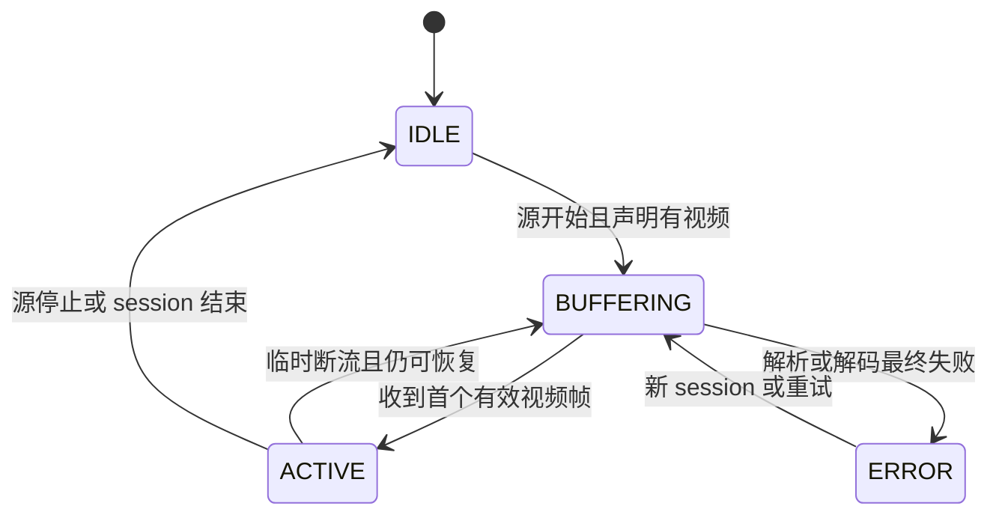
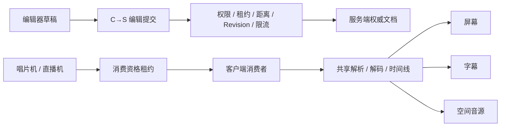

# 中控台设计

中控台是绑定现代化唱片机或直播机的空间媒体场景编排方块。玩家在三栏编辑器中以附近地形为参照，布置共享同一媒体会话的屏幕、字幕和空间音源。

本文只描述稳定的产品与架构规格，不记录当前测试数量、单次性能数据或逐日实现过程：

- 当前实现进度与历史：[`control-console-implementation-status.md`](control-console-implementation-status.md)
- 测试、Bench 与验收证据：[`control-console-validation.md`](control-console-validation.md)

## 设计边界

### 目标

1. 一个中控台首版绑定一个现代化唱片机或直播机。
2. 一个源驱动多个屏幕、字幕和音源，但共享解析、解码、帧、PCM 与时间线。
3. 服务端是文档、权限、revision、绑定和消费资格的权威来源。
4. 玩家只有处于中控台 hardRange 并持有有效消费租约时，才建立本地媒体消费者。
5. 离开 hardRange 后执行真实取消、停止和资源释放，不能只隐藏画面或把音量设为零。
6. 编辑器只读取客户端已加载的世界，不强制加载区块，不创建第二个 `LevelRenderer`。

### 非目标

- 不成为新的播放器或播放协调器。
- 不在方块实体或网络包中保存媒体 URL、PCM、视频帧、纹理或 CDN 内容。
- 不替代唱片机、直播机的播放控制和白名单规则。
- 首版不支持递归元素树或多选批量编辑。
- Phase 8 的独立 Lib/JiJ 发布不属于当前中控台功能验收范围。

## 首版参数

| 参数 | 首版建议 | 语义 |
|---|---:|---|
| hardRange 半尺寸 | X/Z 各 64 格，Y 轴上下各 32 格 | 以中控台中心为基准的 AABB 消费边界 |
| 重入内缩 | 2 格 | 离开后需进入内缩 AABB 才可重新获取消费者 |
| 距离淡变带 | 4 格 | hardRange 六个边界面内侧的淡变范围 |
| 时间淡变 | 250 ms | 突发退出或重入包络 |
| 编辑距离 | 8 格 | 打开、续租和提交修改的最大距离 |
| 完整文档 | 64 KiB | 服务端接受的序列化快照硬上限 |
| 草稿防抖 | 约 10 tick | 拖动本地预览，停顿或松手后提交 |
| 地形逻辑范围 | 等于 hardRange | 范围变化时预览边界同步变化 |

参数由服务端统一配置和校验。元素不设产品级数量上限；实现可设置网络、NBT 与内存防御阈值。

## 用户流程

### 绑定

玩家先用中控台物品右键现代化唱片机或直播机。物品记录源类型、维度和坐标；放置中控台时服务端重新验证目标区块已加载且方块实体类型匹配。绑定不能强制加载目标区块。

```text
ConsoleSourceRef
  kind: TURNTABLE | LIVE_STREAMER
  dimension: ResourceKey<Level>
  pos: BlockPos
```

首版源与中控台位于同一维度。源未加载、被拆除或类型改变时，中控台进入源不可用状态。

### 编辑

1. 玩家在编辑距离内请求打开中控台。
2. 服务端验证权限并签发短期独占编辑租约。
3. 客户端加载权威文档并建立本地草稿。
4. 玩家添加、选择和变换屏幕、字幕或音源。
5. 连续拖动只更新草稿；停顿或松手后合并提交。
6. 服务端按租约、权限、距离和 `baseRevision` 校验，成功后递增 revision。
7. 冲突时拒绝静默覆盖，并返回或重新取得最新权威文档。

### 播放

玩家在 hardRange 内并取得消费租约后，客户端按绑定源当前 session 建立消费者：屏幕显示主视频或稳定占位，字幕读取统一时间线，音源复用共享 PCM。源停止时布局仍存在，重型资源停止，屏幕回到占位状态。

## 三栏编辑器

```text
┌──────────────┬────────────────────────────────┬──────────────────┐
│ 元素层级      │ hardRange 地形场景视口          │ 参数检查器         │
│ + 屏幕        │ 地形 / 中控台 / 元素 / Gizmo    │ 变换              │
│ + 字幕        │ 透视 / 正视 / 侧视 / 顶视       │ 类型专属参数       │
│ + 音源        │ 范围框 / 网格 / 吸附             │ 状态与诊断         │
└──────────────┴────────────────────────────────┴──────────────────┘
```

### 元素层级

左栏负责添加、选择、重命名、复制、删除、显示、锁定和状态提示。首版元素直接位于中控台局部空间，不形成递归父子树。

### 场景视口

中央视口显示中控台、hardRange 内已知地形、未知区域、场景元素、Gizmo 和范围边界。相机、投影、拾取和 Gizmo 共享同一 `viewMatrix + projectionMatrix`。

地形分为 `UNKNOWN / NEAR / MID / FAR`。客户端不得因预览加载新区块。世界读取在客户端主线程按预算完成，后台只消费不可变快照，渲染线程只上传和释放 GPU 资源。

### 参数检查器

选中元素时显示变换和类型专属参数；未选中时显示中控台名称、绑定源、hardRange、权限、schema/revision、元素统计和资源摘要。输入必须显示单位、范围、重置入口和拒绝原因。

## 通用编辑器内核

全息眼镜和中控台复用相机、投影、拾取、Gizmo、选择和命令栈。

```text
EditorCameraState
  mode: ORBIT | FLY | ORTHOGRAPHIC | FIRST_PERSON
  position: Vec3d
  orientation: Quaternionf
  focus: Vec3d
  fovDegrees: float
  orthoScale: float

EditorSession<E>
  authoritativeDocument
  draftDocument
  selection
  cameraState
  activeTool
  coordinateSpace
  undoStack
  redoStack
```

通用内核不知道唱片机、直播机、网络 payload、ItemStack 或 decoder；宿主适配器负责业务字段、权威提交、媒体预览和环境渲染。

## 坐标与变换

元素使用中控台局部坐标。原点和轴约定由序列化、编辑器、世界 renderer 和 hardRange 校验共同复用。中控台朝向改变时，元素整体跟随，不改写局部数据。

```text
Transform
  position: Vec3f
  rotation: yaw, pitch, roll
  scale: Vec3f
  pivot: Vec3f
  skew: xByY, yByX
```

服务端校验有限浮点、旋转规范化、正 scale、有界 skew，以及旋转后屏幕/字幕几何和音源中心位于 hardRange 内。

## 元素模型

### 屏幕

```text
ScreenSettings
  aspect: float
  fitMode: CONTAIN | COVER | STRETCH
  brightness: float
  doubleSided: boolean
  placeholderStyle: IDLE | NO_VIDEO | ERROR
  mediaChannel: PRIMARY_VIDEO
```

同一源/session 的屏幕共享视频帧、纹理和 decoder。

### 字幕

```text
SubtitleSettings
  source: LYRICS | TRANSLATION | LIVE_TITLE | PLAYBACK_STATUS | CUSTOM_TEXT
  fontScale: float
  maxWidth: float
  alignment: LEFT | CENTER | RIGHT
  color: ARGB
  backgroundColor: ARGB
  scrollMode: STATIC | CURRENT_LINE | MULTI_LINE
  customText: String?
```

歌词与翻译读取统一播放时钟，不允许每个字幕独立累计 tick。

### 音源

```text
AudioSourceSettings
  volume: float
  intensity: float
  maxAudibleDistance: float
  attenuation: INVERSE | LINEAR | CUSTOM_CURVE
  channelMode: STEREO_MIX | MONO | LOGICAL_CHANNEL
  logicalChannel: int?
```

多个音源共享 PCM，只创建必要的空间输出或混音节点。

## 视频状态与占位



无视频帧时屏幕仍提交稳定占位。占位不得创建 decoder、帧队列或 HTTP 请求；隐私遮挡与无源、缓冲、错误保持不同语义。

## 权威数据模型

```text
ControlConsoleDocument
  schemaVersion: int
  revision: long
  consoleId: UUID
  name: String
  ownerId: UUID?
  accessMode: OWNER_ONLY | TRUSTED | PUBLIC_EDIT
  source: ConsoleSourceRef?
  hardRangeHalfExtents: Vec3f
  reentryInsetBlocks: float
  audioFadeBandBlocks: float
  audioFadeDurationMillis: int
  elements: List<ConsoleElement>

ConsoleElement
  elementId: UUID
  type: SCREEN | SUBTITLE | AUDIO_SOURCE
  name: String
  enabled: boolean
  locked: boolean
  transform: Transform
  settings: ScreenSettings | SubtitleSettings | AudioSourceSettings
```

方块实体只持久化文档，不持久化消费者、租约、请求、decoder、OpenAL、视频帧、GPU 资源、地形快照或相机。`schemaVersion` 管理迁移，`revision` 管理并发；未知未来 schema 不得按旧结构写回。

## 架构与所有权



服务端资格层不执行客户端媒体解码；客户端按 source/session/consumer 管理共享资源引用；编辑器只修改草稿，不能绕过服务端直接修改方块实体。

## hardRange 与淡变

消费资格采用严格内侧 AABB 判定：

$$
|p_x-c_x|<h_x\land|p_y-c_y|<h_y\land|p_z-c_z|<h_z
$$

到最近边界面的余量为 $m=\min(h_x-|p_x-c_x|,h_y-|p_y-c_y|,h_z-|p_z-c_z|)$。令 $t=\operatorname{clamp}(m/4,0,1)$，距离增益为 $g_{range}=3t^2-2t^3$。

瞬移、换维度、死亡、租约撤销或范围突变使用最长 250 ms 时间包络；世界卸载、设备丢失或客户端关闭直接 hard-stop。离开后需进入每轴内缩 2 格的重入 AABB 才可重新获取消费者。

## 退出与资源语义

退出完成以资源真实停止和释放为准：停止续租并拒绝迟到结果；取消解析、HTTP 和读取；停止 decoder/native worker；hard-stop OpenAL；清空队列；在渲染线程释放纹理/PBO；注销监听和索引。只保留轻量文档镜像和共享静态占位。

一个消费者退出不能停止其他中控台、投影仪、GUI 或玩家仍在使用的共享 session。

## 网络与信任边界

服务端验证玩家、维度、已加载目标、编辑距离、ACL、编辑租约、revision、operationId、元素身份与类型、有限浮点值、几何范围、集合和文档大小。

客户端不得提交 CDN URL、解析后播放地址、服务端 session、服务端时间线或自称“位于范围内”的资格。消费租约建议有效 3 秒并约每秒续期；客户端距离门控负责即时停止，租约过期负责丢包和失联兜底。

## 性能与降级原则

1. hardRange 决定逻辑覆盖，LOD 决定显示成本。
2. 多屏、多字幕和多音源分别共享视频、时间线和 PCM。
3. 世界读取、后台编译和 GPU 上传各自受预算限制。
4. 地形缓存按世界、维度、中控台和 section 隔离。
5. 编辑器关闭后停止采样并释放专属资源。
6. 降级顺序：远场地形 → 预览分辨率 → 阴影/透明排序 → 静态占位。
7. 不允许通过延迟 hardRange 停止或保留静音解码换取流畅度。

## 持久化与可观测性

缺失字段使用集中默认值；未知元素保留或只读隔离；非法元素局部隔离；revision 仅在服务端成功提交后递增；未来 schema 禁止破坏性旧格式回写。

诊断提供文档/revision、源/session、租约、范围状态、HTTP、decoder、OpenAL、队列、纹理/PBO、地形缓存、停止原因、关闭耗时、拒绝、冲突和限流统计。诊断只保存有界标量，不得持有重型资源。Java heap、direct、native、FFmpeg、OpenAL 和 GPU 指标不得直接相加。

## 验收原则

完成标准不是“界面像建模软件”或“范围外看不见”，而是：

1. 可在 hardRange 地形中稳定编排三类元素；
2. 无活动视频时有稳定、低成本占位；
3. 进出范围平滑且截止后真实停止；
4. 某玩家退出不影响源和其他有效消费者；
5. 服务端始终是配置、权限、revision 和资格权威；
6. terrain 通过 LOD、缓存和增量更新满足预算；
7. 编辑器内核由全息眼镜和中控台共同复用；
8. 声明由 [`control-console-validation.md`](control-console-validation.md) 中的可重复证据支持。
