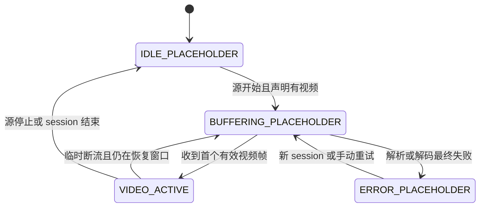
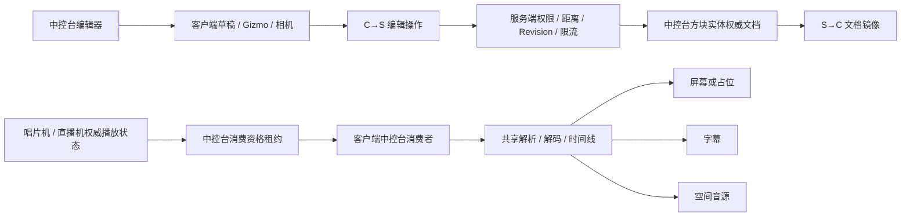
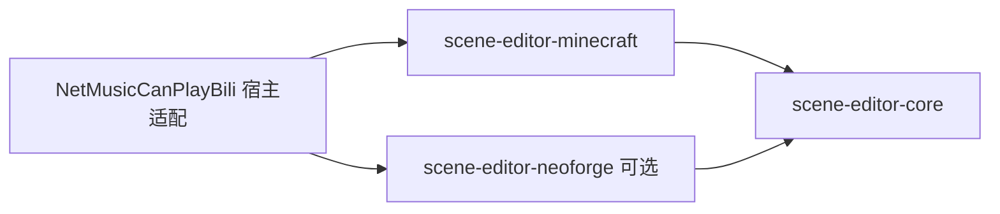
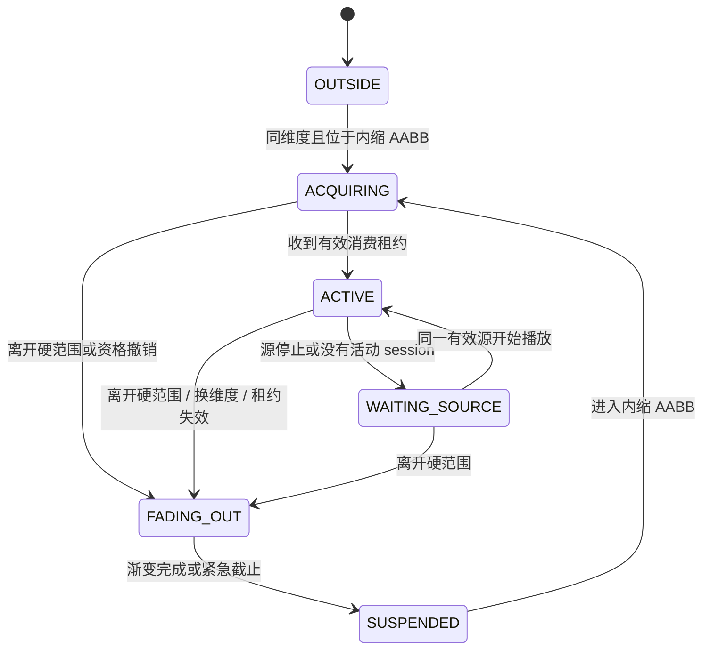

# 中控台实现状态与历史账本

> 本文档由原始混合设计文档于 2026-08-05 无损迁移而来，保留实现过程、Phase 0–8、历史方案和详细技术记录，避免拆分时丢失上下文。稳定产品与架构规格见 [`control-console-design.md`](control-console-design.md)；可重复的测试、Bench 和实测证据见 [`control-console-validation.md`](control-console-validation.md)。
>
> 本文后半仍保留部分原始规格作为历史上下文；如与稳定设计文档冲突，以稳定设计文档为目标规格，以本文顶部“当前实现状态”为当前代码状态。schema v3/v4、固定 ±25 terrain 等文字仅代表历史阶段，当前实现为 schema v5 和权威 hardRange。

中控台是一个绑定现代化唱片机或直播机的**空间媒体场景编排方块**。玩家可以在类似 Unity / BlockBench 的三栏编辑器中，以中控台附近地形为参照，添加并布置屏幕、字幕和音源元素。

中控台不是新的播放器，也不复制唱片机或直播机的播放状态、媒体 URL 和解码逻辑。服务端源设备仍然负责播放意图和时间线；中控台负责持久化场景布局，并为每名处于硬范围内的玩家建立受范围约束的客户端媒体消费者。

## 核心设计结论

- 一个中控台首版绑定一个现代化唱片机或直播机。
- 一个绑定源可以驱动多个屏幕、字幕和音源元素。
- 左侧是元素层级和添加面板，中间是完整硬范围的地形场景视口，右侧是上下文参数检查器。
- 屏幕和字幕支持位置、`yaw`、`pitch`、`roll`、缩放、枢轴和二维剪切；音源首版主要使用位置和声学参数。
- 中控台有独立的轴对齐长方体硬范围（AABB）。超出范围后，该玩家的中控台媒体消费者停止解析、解码、视频和音频输出，但不会停止源设备，也不会影响其他玩家。
- 进出硬范围时音频采用短暂淡入淡出；硬范围之外仍必须完成真实资源停止，不能仅把音量设为零。
- 地形预览大小等于中控台硬范围，不再使用独立的小型预览半径。
- 没有可用视频帧时，屏幕显示中控台专属占位图片；占位逻辑与视频投影仪不同，但可复用全息眼镜占位层的双面纹理渲染方式。

以下数值均为**首版建议、可调整**，最终应由同一套服务端配置和校验规则提供，不能散落为客户端与服务端各自不同的魔法数字。

| 参数 | 首版建议 | 语义 |
|---|---:|---|
| 硬范围半尺寸 | X/Z 各 64 格，Y 轴上下各 32 格 | 以中控台中心为基准的轴对齐长方体媒体消费边界 |
| 重入内缩 | 2 格 | 离开后必须进入各边界面向内收缩 2 格的 AABB 才重新获取消费者 |
| 音频淡变带宽 | 4 格 | 靠近任意硬范围边界面的最后 4 格内淡出，重新进入时反向淡入 |
| 音频时间淡变 | 250 ms | 瞬移、换维度、租约失效等无法经过距离带时使用 |
| 编辑距离 | 8 格 | 打开界面、申请租约和提交修改的最大距离 |
| 元素数量 | 不设产品级上限 | 仅受网络/NBT 防御性包体与内存阈值约束 |
| 地形预览范围 | 等于硬范围 | 硬范围变化时预览边界同步变化 |
| 完整文档大小 | 64 KiB | 服务端接受的序列化快照硬上限 |
| 草稿合并提交 | 500 ms | 拖动时本地预览，停顿或松手后提交 |

## 当前实现状态（截至 2026-08-04）

本节是本文档中**当前实现状态的唯一真源**。其余章节中的数据结构、状态机和参数若未在本节标为已实现，均应理解为目标规格或历史实施记录，而不是现有代码保证。

### 2026-08-04 收口增量（优先于本节下方旧描述）

下方较早状态中关于 schema v3、视频不透明、直播未适配、terrain 固定 ±25 和 chunk unload 缺失的描述已经过时；以本增量为准：

- 文档已升级为 schema v5，持久化稳定 `consoleId`、稳定 `elementId`、`sourceKind` 和 `locked`；v5 会把 v4 中恰好等于历史默认 8/4/8 的 hardRange 一次性迁移为稳定设计默认 64/32/64，自定义过任一轴的范围保持不变。旧 schema 使用仅依赖维度、方块坐标与原始元素序号的确定性 UUID 迁移。临时物品绑定同时保存维度和源 kind，放置时再次验证实际方块实体类型。
- 服务端在文档替换时验证旋转后屏幕/字幕四角点与音源中心点均处于 hardRange。已有锁定元素不能被整快照修改或删除；唯一允许的例外是其他字段完全不变的显式解锁。官方客户端同时禁用锁定元素的属性编辑、内容按钮、复制、Gizmo、历史恢复和预设变换。
- 250 ms smoothstep 已同时覆盖突发退出和重新进入。RGBA、YUV420P、NV12、loading overlay 与 Iris immediate 路径均使用消费者独立顶点 alpha、标准 translucent blend、关闭深度写入且不使用 alpha cutout；半透明 quad 只提交一次，避免双面重复混合。共享帧、纹理和播放实例没有复制。
- 中控台按 `sourceKind` 统一适配唱片机与直播机。直播机把中控台坐标和实体投影仪坐标合并进同一 session consumer 集合，仍只创建一个 decoder/texture；直播音频 relay 复用 source-position 主输出。服务端消费租约会拒绝跨维度、源区块未加载及 kind/方块实体不匹配的绑定。直播标题、房间信息等元数据字幕仍未实现。
- terrain bounds 已由固定入口窗口切换为权威 hardRange，并裁剪世界高度。覆盖使用不预分配完整范围的距离优先游标，每 tick 最多检查 64 个候选，pending 上限 512，UNKNOWN 表示上限 256；未加载 chunk 不触发强载，以裁切到 hardRange 的 UNKNOWN 线框表示。chunk unload 会清理 CPU snapshot/pending、发布持久 tombstone、释放 GPU TLSF allocation并拒绝迟到编译复活；自然 load 后重新捕获。
- terrain 已完成 hardRange 覆盖、UNKNOWN、chunk load/unload tombstone、NEAR 原版全材质、MID 4³ 聚合概览、FAR 8³ 聚合概览和随相机/选择目标可逆重评。LOD 降级会释放旧 NEAR GPU section，迟到编译仍由 generation/epoch/source identity 拒绝。当前 MID/FAR 是分类线框概览，不是完整材质简化网格；方块实体 renderer、自定义模组 `ColorResolver` 和 quad 级透明重排仍未完成。
- 当前完整 Gradle 回归为 **109 suites / 373 tests / 0 failures / 0 errors / 0 skipped**；`git diff --check` 无 whitespace error。ModBench 在 Windows 11、Java 25、Minecraft 26.1.2、NeoForge 26.1.2.76 和 RTX 5070 Ti Laptop GPU 上完成五条 integrated-client 场景：100 轮共享中控台 consumer 引用生命周期、30 轮编辑器 Screen 初始化/渲染/interaction-tree 快照/关闭、terrain NEAR→FAR→NEAR 往返、40 tick 视频/OpenAL/HTTP/自有内存空闲收敛，以及各 30 帧的 640×360 RGBA/YUV420P/NV12 确定性本地 GPU 上传和显式释放，统一报告 `PASSED`。GPU 场景确实命中 YUV staging 与三槽 NV12 PBO；最新 90 次上传整体均值 0.737 ms、P95 1.558 ms，staging 峰值 345,600 bytes、PBO 峰值 1,036,800 bytes，释放后均回到场景基线。上传耗时是单次机器观测而非硬阈值。这些证据仍不替代 Iris/shaderpack、多客户端、真实 HTTP/decoder/OpenAL 有负载启停和跨硬范围 100 次系统基线。

仍未完成且属于 Phase 0–7 的关键项：pivot/skew/非均匀 scale、本地/世界 Gizmo、全部编辑操作统一命令栈、冲突回包携带权威文档、HTTP API/登录二维码请求族的逐请求取消接线、中控台专属四态美术、直播标题/房间元数据字幕、真实媒体有负载的 100 次资源基线以及多人/Iris/shaderpack 集成验收。Phase 8 继续明确排除在当前范围外。

当前中控台已经形成可运行纵切：可放置并绑定现代化唱片机或直播机，使用 schema v5 文档持久化稳定身份、锁定状态、所有者、访问模式、可信玩家、名称、源 kind/坐标、三轴硬范围和屏幕/字幕/音源元素；三栏编辑器支持三类元素的添加、选择、复制、位置及 yaw/pitch/roll 编辑，并通过带 revision 和 operationId 的完整快照进行约 10 tick 防抖自动保存。服务端已校验玩家 `mayBuild`、owner/accessMode/trusted ACL、8 格编辑距离、目标区块与方块实体类型、字段有限值、4096 元素防御阈值、64 KiB 完整快照、基础限流和 revision 乐观并发。

唱片机媒体纵切已经接通：多个屏幕复用同一唱片机视频 session 和帧；字幕可使用固定文本、静态歌词、主轨滚动和翻译轨滚动；多个音源通过独立 OpenAL relay 复用主 PCM，并支持音量、逻辑声道、独立最大听距和自动混合 JOC。上述能力已经贯通编辑草稿、NBT、网络和客户端运行时。

中控台屏幕已有独立 `IDLE / BUFFERING / ERROR / ACTIVE` 运行时状态：源停止或纯音频为 IDLE，解析/等待首帧为 BUFFERING，解析或解码终态失败稳定保留 ERROR，只有真实上传视频帧才进入 ACTIVE。消费者有效时屏幕始终提交画面，不再因无帧消失；当前三类占位暂时复用通用 320×180 视频占位资源，专属中控台美术仍待替换。屏幕世界几何始终使用元素持久化的 `aspect`，不再随视频或占位纹理比例跳变。

媒体消费现在采用双重门控：服务端按玩家、中控台维度/坐标和真实位置签发 3 秒消费租约，客户端约每秒续期；客户端同时以真实玩家位置执行严格 hardRange AABB、边界内 4 格 smoothstep 增益和离开后每轴内缩 2 格的重入迟滞。正常走过距离淡变带后在边界立即停止；瞬移跳过淡变带、非空世界间换维度、租约失效、hardRange 突缩、源失效或单个中控台移除时进入最长 250 ms smoothstep 退出包络，立即停止续租并 RELEASE，截止后移除视频 consumer/投影映射并 cleanup OpenAL relay。音频 relay、字幕文字/背景以及 RGBA、YUV420P、NV12、loading overlay 与 Iris immediate 视频路径均使用消费者独立 alpha 做退出和重入 smoothstep；断线、世界卸载和内存熔断仍立即 hard-stop。

共享视频解析现已在异步结果回到客户端线程后重新验证 requestId、唱片机当前 session/播放状态和实时消费者集合；调度时捕获的旧中控台坐标不能再授权创建实例或错误占位。最后一个中控台退出且没有物理/BER 投影仪、全息眼镜或 GUI 消费者时会使在途 request 失效；迟到成功或失败结果只计入 drop 诊断，不会复活 decoder、pending loading 或 pending failure。`/ncpbc video status` 可查看 active session/request、pending resolve/loading/failure、消费者引用和 stale/no-consumer drop 数量；开启内存诊断时同一快照会进入低频日志。

视频实例从活动表移除后会进入独立、纯标量且有界的关闭诊断状态机，不保留 decoder、线程、future、纹理或 relay 强引用。当前分别观察 frame queue 清空、decoder `close()` 返回、外层 decode thread 退出、native decoder worker 终止和 render-thread 纹理/YUV/PBO release 调用返回；默认 3 秒 soft timeout、6 秒 hard timeout，各阈值只告警一次，并记录 hard timeout 后的迟到收敛、最老 pending 年龄和容量丢弃数。该汇总已进入 `/ncpbc video status` 和低频内存日志。render release 返回只证明 GL 删除调用已经执行并返回，不代表驱动显存物理回落；decoder close 返回也不等同于 native worker 终止，二者保持独立阶段。

OpenAL source/buffer 的关闭也已按 native batch 分配纯标量 operationId：实例 cleanup 转移句柄所有权后立即释放 staging buffer，native batch 进入单飞串行删除队列；无可用 context 时标记 deferred，客户端 tick 每 500 ms 节流重试，后续 init 获得 context 时也会 drain。只有 best-effort source/buffer 删除循环返回后才记录收敛，默认 500 ms soft timeout、3 秒 hard timeout，并统计 pending/deferred batch、最老年龄和迟到收敛。relay 与 Dolby/Stereo handler 的 terminal cleanup 已原子幂等，registry 替换/注销会先从 handler detach 再 cleanup，旧 handler terminal cleanup 后清空 relay 引用。该完成点仍只表示 OpenAL 删除调用循环已经返回，不证明驱动物理内存即时回落；单项删除异常当前仍按既有策略吞掉。

### 已实现

- schema v3 `Document` Compound、schema 1/2 根字段兼容读取、未来 schema 子树只读保留、方块实体镜像、revision 和最近 64 个 operationId 去重；
- 放置者所有权、旧世界首次合法使用认领、`OWNER_ONLY / TRUSTED / PUBLIC_EDIT`、最多 256 个可信 UUID、独立 ACL 配置包和管理员恢复权限节点；
- 三栏编辑器、统一相机矩阵、orbit/pan/dolly/fly、正交/透视视图、聚焦、元素拾取和三轴 Gizmo；
- 纯客户端灵魂漫游、硬范围相机约束、1/2/3 放置和完整元素内容快照返回；
- 唱片机多屏共享视频 session、歌词统一时间线和共享 PCM 空间音源；
- 字幕静态/滚动模式及音源音量、声道、最大听距和 autoMixJoc；
- 每玩家独立的 3 秒消费租约、约 1 秒续期、客户端严格 hardRange 即时门控、4 格 smoothstep 音频淡变、2 格重入迟滞、250 ms 突发退出音频/字幕包络，以及中控台视频/音频消费者截止后真实注销；
- 中控台 `IDLE / BUFFERING / ERROR / ACTIVE` 视频状态机、解析/解码终态失败保留、无帧稳定占位和元素 `aspect` 世界渲染消费；
- 异步视频解析启动前实时消费者准入、最后中控台退出时 request 失效、迟到结果防复活，以及视频 session/request/pending/consumer 轻量诊断；
- 视频实例 frame queue、decoder close、decode thread、native worker 和 render release 五阶段关闭耗时诊断、soft/hard timeout 与迟到收敛统计；
- OpenAL native source/buffer batch operationId、无 context deferred queue、节流重试/drain、关闭超时和迟到收敛统计；
- terrain 已加载区块读取、dirty section、20³ 邻域、原版方块模型/AO/光照/tint、流体编译、单线程单飞 compiler、共享 GPU 堆和分层批量绘制。

### 部分实现

- 服务端配置权威：已有 `mayBuild`、owner/accessMode/trusted ACL、授权后打开、10 秒独占编辑租约、距离、区块、字段、按元素类型的 contentMode、64 KiB 包体、限流和 revision 校验，但没有字段级拒绝原因；
- 自动保存冲突：会保留本地草稿并返回状态，但冲突包不携带权威文档，“重新加载服务器版”依赖本地 BE 镜像已经同步；
- 元素历史：Gizmo 拖动进入撤销栈，数值输入、添加、复制、删除和内容字段尚未全部进入命令栈；
- 字幕：固定文本、歌词/翻译轨、滚动窗口、主色、译文色、背景色、左/中/右对齐、最大宽度和 `Font.split` 换行已经贯通检查器、漫游、NBT、packet 与普通/滚动 renderer；AI 字幕仍未实现；
- 音源：唱片机路径和直播 source-position 主输出 relay 已接通；直播标题、房间信息等元数据字幕仍未实现；
- terrain：hardRange、UNKNOWN、chunk load/unload tombstone、NEAR/MID/FAR 和 GPU 降级释放已接通；MID/FAR 当前为聚合分类线框，尚无完整材质简化网格、方块实体 renderer、自定义模组 tint 协议和 quad 级透明重排。

### 尚未实现

1. 真实媒体有负载条件下最后一个共享消费者退出后的 100 次 HTTP/decoder/纹理/PBO/OpenAL 系统资源基线；当前 100 轮 consumer 引用生命周期、空闲资源收敛、视频 alpha 淡出/淡入和迟到结果防复活已经通过真实 integrated-client Bench；
2. 同步 B 站 API resolve 的逐请求尽力取消、停止原因与关闭耗时诊断；实例/decoder/纹理 stop 路径和视频五阶段关闭耗时/超时诊断已经实现；
3. 中控台 IDLE/BUFFERING/ERROR 专属美术资源；四态运行时与无帧稳定占位已经实现，当前暂时复用通用视频占位资源；
4. 直播标题、房间信息与状态元数据字幕；直播视频 consumer 与直播音频 relay 已接通；
5. pivot、skew、非均匀 scale 和本地/世界 Gizmo；稳定 `consoleId`、`elementId`、`sourceKind`、`locked`、旋转后 hardRange 校验及带维度临时绑定已经实现；
6. 全部编辑操作统一进入命令栈，以及冲突回包直接携带权威文档；
7. terrain MID/FAR 完整材质简化网格、方块实体 renderer、自定义模组 tint 协议和 quad 级透明重排；hardRange、分层 LOD、chunk tombstone 与 GPU 清理已经实现；
8. HTTP Range/分片、CDN 首包/小范围 race 和 HTTP-FLV 建连已接入有界纯标量诊断，记录 started/headers/body published/cancel/body close/terminal，并持有可取消的根 `sendAsync` future；竞速任务使用可中断的 executor `Future`，winner/timeout 后会直接中断输家并取消其根 HTTP future。本地慢速双 HTTP server 已覆盖 headers 前中断、body 发布后提前关闭和 winner 后输家收敛。API 与登录二维码请求仍需接入同一契约；视频五阶段和 OpenAL native batch/deferred drain 已实现，但 OpenAL 单项删除失败尚未独立计数；
9. 多客户端、Iris/shaderpack、跨维度/断线重连与真实媒体有负载 100 次系统验收；
10. 同仓多项目、Maven Lib/JiJ 发布与第三方示例宿主。

### 当前不能宣称已满足的验收项

- hardRange 已用于服务端消费资格、客户端即时门控、边界增益、250 ms 视频/音频/字幕退出与重入包络和中控台消费者注销；异步 resolve 已不能在最后消费者退出后复活实例，但**尚未以真实媒体有负载的 100 次资源基线证明同步 API HTTP、decoder、GPU 和 OpenAL 总能在有界时间回落**；
- terrain 已覆盖权威 hardRange 并支持 UNKNOWN/NEAR/MID/FAR 与 chunk tombstone，但**MID/FAR 当前是聚合分类线框，不等于完整材质远景产品路径**；
- 中控台直播视频和直播音频 relay 已接通，但**直播标题、房间信息和状态元数据字幕仍未实现**；
- 64 KiB 快照限制、字段级防御、ACL、编辑租约与消费租约已经存在，但**不等于共享媒体资源生命周期已完成系统性验收**；
- schema v3 已把业务数据迁入独立 `Document` Compound；未来 schema 会停止编辑并结构级原样回写该子树。受公开 `ValueInput` API 限制，schema 1/2 旧式根层未知字段不承诺透明保留。

在真实媒体有负载的 100 次共享源资源基线、其余 HTTP API/登录请求族逐请求关闭接线和多人/Iris 系统验收完成前，中控台应描述为“具备服务端授权编辑、完整 hardRange 地形 LOD、范围消费门控、有界视频/音频/字幕淡变、迟到解析防复活及视频/OpenAL/媒体流 HTTP 关闭收敛诊断、可持久化并已接通唱片机与直播媒体的功能完整 Beta”，不应宣称已满足最终资源生命周期和多人兼容验收。

## 目标与非目标

### 目标

1. 统一编排唱片机或直播机的屏幕、字幕和空间音源。
2. 在完整硬范围地形中直观编辑元素位置、姿态和大小。
3. 让多个视觉和声音元素共享同一媒体会话，避免重复解析和解码。
4. 以服务端为配置、权限和范围资格的权威来源。
5. 把硬范围设计为明确、可测试、可观测的资源生命周期边界。
6. 支持源未播放、正在缓冲、无视频轨和播放失败等状态下的稳定占位画面。

### 非目标

- 不成为第五套播放协调器。
- 不把完整媒体、PCM、视频帧或 CDN 内容写入方块实体和网络包。
- 不替代唱片机、直播机自身的播放控制和白名单规则。
- 不在编辑器中创建第二个完整 `LevelRenderer`。
- 不允许地形预览强制加载区块或读取客户端尚未获得的世界信息。
- 首版不支持递归父子树和多选批量编辑；所有元素直接使用中控台局部坐标。

## 通用场景编辑器前置升级

中控台不应复制一套新的建模交互。现有全息眼镜配置器已经具备屏幕选择、透视投影、点击拾取和移动/旋转/缩放 Gizmo，但它还不是完整的类建模编辑器。中控台实施前，应先把全息眼镜编辑能力升级为一套可复用的通用场景编辑器内核，再由全息眼镜和中控台分别提供业务适配层。

### 历史全息编辑器基线（升级前）

当前 `HolographicScreenConfigTestScreen` 的视口只保存：

- `previewYaw`；
- `previewPitch`；
- `previewScale`；
- 固定的 `ORBIT_TARGET_Y`；
- 由固定常量和 scale 推导的相机距离。

拖动空白区域只能绕固定目标旋转视角，滚轮只改变等价缩放。当前没有：

- 可直接编辑的摄像机世界位置；
- 相机焦点平移（pan）；
- 沿视线 dolly；
- WASD / QE 自由飞行；
- 正交相机的位置和视口尺度；
- 聚焦选中对象后继续平移观察的能力；
- 相机书签或每个编辑器独立的视口状态；
- 完整 yaw/pitch/roll 元素旋转；
- pivot、skew、本地/世界坐标切换；
- 通用撤销/重做命令栈。

以上是 Phase 0 冻结的历史基线，不代表当前相机实现；当前 orbit、pan、dolly、fly、正交/透视和统一矩阵状态见“当前实现状态”与 Phase 1 记录。仍未完成的是 pivot、skew、非均匀 scale、本地/世界 Gizmo 和所有编辑操作统一进入命令栈。

### 目标能力

全息眼镜和中控台最终共享以下类建模能力：

1. **自由透视相机**：相机有明确 `position`、`orientation`、`focus`、`fov`、near/far plane。
2. **轨道模式**：左键拖动视口空白区域，围绕当前焦点旋转；左键命中 Gizmo 时优先操作对象，可通过 `F` 聚焦选中对象。
3. **平移模式**：右键拖动视口空白区域，沿相机 right/up 平面移动相机和焦点；中键暂不绑定任何编辑器操作。
4. **Dolly 与缩放**：滚轮沿视线移动透视相机；正交视图中改变 `orthoScale`，不再把两者混为一个 `previewScale`。
5. **自由飞行**：采用建模软件键位，W/S 上下、A/D 左右、Q/E 前后、Shift 加速；输入焦点在文本框时禁用。
6. **标准视图**：前、后、左、右、顶、底、透视和第一人称；正交/透视切换保持当前焦点。
7. **完整对象变换**：position、yaw/pitch/roll、scale、pivot、skew，并支持本地/世界空间 Gizmo。
8. **可靠拾取**：元素、Gizmo、地形辅助对象使用统一 camera/view/projection 矩阵进行投影、射线和深度排序。
  - 交互优先级固定为 Gizmo 手柄最高；玩家、屏幕和后续场景元素必须比较同一拾取射线上的最近命中距离，同深度时可编辑元素优先于进入第一人称入口。
  - 右下角方向轴必须按相机空间深度采用“后轴 → 中央轴心 → 前轴”分层绘制，不能用世界轴正负代替前后关系。
9. **编辑历史**：拖动开始创建事务，拖动过程更新草稿，松手形成一个可撤销命令；数值输入、添加、删除、复制同样进入命令栈。
10. **视口状态隔离**：相机、网格、吸附、显示层和选中项属于本地编辑会话，不写入媒体设备的服务端业务文档；可选保存为客户端布局偏好。

### 通用相机模型

```text
EditorCameraState
  mode: ORBIT | FLY | ORTHOGRAPHIC | FIRST_PERSON
  position: Vec3d
  orientation: Quaternionf
  focus: Vec3d
  fovDegrees: float
  orthoScale: float
  nearPlane: float
  farPlane: float
```

相机必须以 `viewMatrix + projectionMatrix` 作为渲染、拾取和 Gizmo 计算的唯一真源。禁止像当前实现一样在 GUI 拾取代码和 PIP 渲染器中分别手写一套由 `previewYaw/previewPitch/previewScale` 推导的近似投影，否则自由移动相机后两套数学会迅速漂移。

`FIRST_PERSON` 是由宿主提供的受约束相机策略：全息眼镜使用玩家眼睛位置，中控台可使用中控台原点或选择的预览观察点。它不应污染通用相机类型和矩阵算法。

### 通用编辑器契约

```text
SceneDocument<E>
  elements: List<E>
  revision: long

SceneElement
  id: UUID
  transform: Transform
  capabilities: ElementCapabilities

EditorSession<E>
  authoritativeDocument
  draftDocument
  selection
  cameraState
  activeTool
  coordinateSpace
  snapSettings
  undoStack
  redoStack

EditorHostAdapter<E>
  loadDocument()
  validateDraft()
  submitOperations()
  renderElement()
  renderEnvironment()
  describeProperties()
```

内核只表达场景元素、相机、工具和操作，不知道唱片机、直播机、全息眼镜物品 NBT、网络 payload 或视频解码器。宿主适配器负责业务字段、服务端提交、媒体预览和地形环境。

### 全息眼镜迁移目标

全息眼镜先成为通用内核的第一个宿主：

- 将当前 `ScreenConfig(distance, offsetX, offsetY, height, aspect, roll)` 映射为通用 `Transform` 和 `HolographicScreenProperties`；
- 对旧物品数据保留兼容读取，迁移时把旧 `roll` 写入新旋转的 Z 分量；
- 不把旧预览 `previewYaw/previewPitch` 迁移为元素姿态，它们只是旧相机状态；
- 升级后的界面支持相机平移、dolly、自由飞行、标准视图和聚焦选择；
- 保存时仍通过服务端权威包写回已装备眼镜，通用内核不直接接触 ItemStack；
- 中控台随后复用同一相机、矩阵、拾取、Gizmo 和命令栈，仅替换场景元素类型、地形环境和提交适配器。

这一顺序可以用较小的全息屏幕场景验证通用内核，再进入完整硬范围地形，降低中控台一次性引入相机、建模、地形和媒体四类风险。

## 用户流程

### 绑定

绑定操作沿用视频投影仪和音响的玩家认知：玩家先用中控台物品右键现代化唱片机或直播机，物品记录目标坐标并以附魔光效提示已绑定，放置后由服务端再次验证目标仍为合法唱片机/直播机，再把当前维度和坐标写入中控台文档。非创造模式放置成功后清理物品上的临时绑定。已经放置的中控台后续也可以在建模界面中重新绑定，但客户端只能提交绑定意图，服务端必须根据世界中的真实方块实体确认源类型。

绑定引用必须包含维度，不能只保存裸 `BlockPos`：

```text
ConsoleSourceRef
  kind: TURNTABLE | LIVE_STREAMER
  dimension: ResourceKey<Level>
  pos: BlockPos
```

首版建议源与中控台位于同一维度。绑定不能强制加载目标区块；目标未加载、被拆除或方块类型改变时，中控台进入“源不可用”状态。

### 编辑

1. 玩家在 8 格内打开中控台。
2. 服务端验证权限并签发短期编辑租约，客户端获得当前权威文档。
3. 玩家在左侧添加屏幕、字幕或音源。
4. 在中央场景中选择元素并使用 Gizmo 调整变换。
5. 在右侧检查器修改类型专属参数。
6. 拖动期间只更新客户端草稿；停顿或松手后发送合并操作。
7. 服务端按 `baseRevision` 校验后提交，递增 revision 并镜像最新状态。

### 播放

玩家处于硬范围并取得有效消费资格时，中控台根据绑定源的当前 session 建立客户端运行时：

- 屏幕消费主视频或显示占位图片；
- 字幕消费统一歌词时间线、直播元信息或自定义文字；
- 音源消费共享 PCM，并在各自位置创建空间输出。

源停止或没有视频时，布局仍然存在，屏幕切换为占位图片，字幕和音源按各自状态停止或显示状态文本。

## 三栏编辑器

```text
┌──────────────┬────────────────────────────────┬──────────────────┐
│ 元素层级      │ 硬范围地形场景视口              │ 参数检查器         │
│ + 屏幕        │ 地形 / 中控台 / 元素 / Gizmo    │ 变换              │
│ + 字幕        │ 透视 / 正视 / 侧视 / 顶视       │ 类型专属参数       │
│ + 音源        │ 范围框 / 网格 / 吸附             │ 状态与诊断         │
└──────────────┴────────────────────────────────┴──────────────────┘
```

### 左栏：元素层级

左栏提供：

- 添加屏幕、字幕和音源；
- 选择、重命名、复制、删除；
- 显示/隐藏和锁定编辑；
- 状态图标：正常、占位、等待源、错误、已禁用；
- 元素数量和类型上限提示。

层级顺序控制编辑器列表顺序，以及透明元素相同深度时的稳定排序，不在首版中形成任意递归父子关系。

建议快捷键：

- `W`：移动；
- `E`：旋转；
- `R`：缩放；
- `Delete`：删除；
- `Ctrl+D`：复制；
- `F`：聚焦选中元素；
- `Shift`：临时启用吸附。

### 中栏：硬范围地形场景

中央视口以中控台方块中心为原点，显示：

1. 中控台模型；
2. 中控台硬范围内的地形；
3. 所有场景元素；
4. 当前选中元素的 Gizmo；
5. 硬范围长方体边框、面或切片线框；
6. 未加载区域、范围边界和潜在遮挡提示。

地形逻辑范围现在覆盖权威 hardRange，并以中控台为稳定原点。客户端只渐进读取已加载 chunk，不强制加载未知区域；UNKNOWN 线框、NEAR 原版全材质、MID 4³ 聚合概览和 FAR 8³ 聚合概览共同控制成本。hardRange 同时驱动范围线框、漫游约束、BER 包围盒和 terrain 覆盖边界。

完整长方体可能覆盖大量方块，因此“范围相同”不代表“每个方块都以完整模型常驻 GPU”。预览采用分层表示：

- **近场高细节层**：中控台和当前选中元素附近保留可辨认方块轮廓与材质类别；
- **中场简化层**：合并相邻实体表面，省略不可见内部面；
- **远场轮廓层**：只保留主要地表、高度、建筑体块和遮挡轮廓；
- **未加载层**：显示半透明网格或未知区域，不触发区块加载；
- **范围外**：不采样、不缓存，只显示边界线框。

预览数据只能来自客户端已加载区块，并按 chunk 维护缓存。方块更新事件只标记相关 chunk dirty，后续 tick 在预算内增量重建。中央视口不得在渲染线程同步扫描整个硬范围，也不得每帧重建全部网格。

中控台采用“首次说明书 → 有 Screen 元素建模 → 无 Screen 世界漫游”的交互。玩家右键中控站台时，若当前玩家尚未选择“不再提醒”，客户端先显示黑金主题说明书；只有勾选复选框并点击“进入中控台”才会按玩家 UUID 将偏好保存到本地客户端配置，直接关闭或按 `Esc` 不会保存。已选择不再提醒的玩家后续直接打开三栏建模 Screen，并默认以中控台中心为建模目标；共享同一客户端的其他玩家仍会独立显示首次说明。该偏好不进入世界存档、不发送给服务端。

从灵魂漫游进入时，准星右键命中哪个元素，就选中该元素并以它的世界包围范围为中心初始化建模相机；灵魂漫游中按 `Esc` 则退出漫游并回到以中控台中心为目标的建模 Screen。直接右键中控站台同样以中控台中心为目标。该自动聚焦只在 Screen 首次打开时执行一次，后续 resize、切换面板和控件重建不会重置玩家已经调整的视角。

点击顶部“魂”按钮或按 `V` 后，客户端冻结当前编辑器相机的位置与视线，正常关闭 Screen 和地形预览，再从该相机对应的世界位置进入纯客户端“灵魂漫游”。Minecraft 继续抓取鼠标并沿用原版灵敏度、平滑相机和 Y 轴反转设置。漫游期间隐藏原版准星，只保留编辑器自定义准星；准星对准虚拟元素后右键按该元素聚焦建模，对准当前中控台方块后右键则以中控台为中心进入建模。

灵魂漫游中按 `1`、`2`、`3` 可分别在代理相机当前位置放置屏幕、字幕和音源元素。元素位置转换为相对于中控台底面中心的局部坐标，朝向使用当前代理相机 yaw/pitch；漫游元素草稿会随返回建模一起传递，不会重新退回默认主屏列表。

灵魂漫游的操作与原版旁观飞行保持一致：`W/S` 按相机 yaw 在水平面前后移动，`A/D` 左右移动，`Space` 上升，`Shift` 下降，疾跑键（默认 `Ctrl`）提供 2 倍水平控制，滚轮每个离散步按 `0.005` 调整独立飞行速度并限制在 `0–0.2`。相机使用速度积分，水平速度按约 `0.91`、垂直速度按约 `0.6` 衰减，松开按键后保留短暂滑行，而不是立即停住。灵魂漫游期间会屏蔽真实玩家的第一人称手臂和手持物渲染，避免代理相机画面中出现“漂浮的手”；退出漫游后恢复原版手部渲染。飞行速度只属于本地漫游会话，不修改真实玩家能力。

“灵魂漫游”不是服务端 `SPECTATOR`。实现使用未加入 `ClientLevel` 实体表的本地 `Marker` 作为 camera entity，真实玩家的位置、旋转、游戏模式、能力和碰撞始终不变，也不发送代理位置或玩家移动包。漫游期间客户端清空真实玩家移动输入并消费攻击、使用、选取和滚轮操作；所有服务端配置提交继续以真实玩家距离和 revision 为准。代理相机强制第一人称以保证主相机、准星和拾取射线同源，退出时恢复进入前的 camera entity 和 `CameraType`。相机允许穿墙但被当前中控台硬范围 AABB 约束，只能看到客户端已经加载的世界，不强制加载远处区块。

漫游会话在 `ESC`、断线、玩家替换、死亡、维度/世界变化、中控台区块卸载、中控台被拆除、其他 Screen 打开或其他相机系统接管 camera entity 时幂等终止。只有当前 camera entity 仍属于该会话时才执行相机恢复，避免覆盖其他模组的相机。建模 Screen 同样绑定打开时的玩家和 `ClientLevel` identity，并在目标失效、超出 8 格编辑距离或生命周期变化时关闭。

当前纵向切片在世界漫游阶段会从建模 Screen 生成不可变元素快照，提交全部屏幕、字幕和音频元素的准确局部位置、尺寸与旋转；同时绘制以中控台为中心、按文档硬范围半径展开的完整 AABB 线框。漫游快照返回建模器后会进入自动保存队列，并写入 `ControlConsoleDocument` 的正式元素列表。字幕 Gizmo 使用文本牌样式，音频 Gizmo 使用扬声器与声波样式，和屏幕的矩形 Gizmo 区分。

建模 PIP 不再一次采样和渲染完整硬范围。每次进入建模时冻结入口中心：从元素进入使用该元素中心，从中控台或 `Esc` 返回使用中控台中心；地形预览只采样该中心周围 X/Y/Z 各半径 25 格的轴对齐立方体。之后在同一 Screen 中切换选择不会移动这次会话的地形边界。灵魂漫游中的音源使用有深度的定向长方体线框，且右键拾取使用同一个旋转箱体，而不是难以辨认的平面矩形。

地形快照同时保留方块模型和非空 `FluidState`。后台 section compiler 使用资源重载后捕获的 `FluidStateModelSet` 与原版 `FluidRenderer`，把水和岩浆按其真实 `ChunkSectionLayer`、流体高度、邻面剔除、光照与 tint 烘焙到共享网格；后台线程不访问 `Minecraft` 或 `ClientLevel`。

灵魂漫游放置元素时，Minecraft 相机 yaw 会转换为编辑器局部旋转约定（取反后写入元素 yaw），避免新元素朝向与准星视线相差 90°。旋转工具显示局部 X/Y/Z 三个独立圆环：红色 X 环修改 pitch，绿色 Y 环修改 yaw，蓝色 Z 环修改 roll；每个环的命中、约束平面和拖拽旋转轴与其视觉圆环一致。

### 右栏：上下文检查器

选中元素时显示：

- 元素类型、名称、启用和锁定状态；
- 位置、旋转、缩放、枢轴、剪切；
- 屏幕的亮度、宽高比、裁剪和双面显示；
- 字幕的来源、字体大小、颜色、背景、对齐和滚动模式；
- 音源的音量、强度、最大听距、衰减曲线和声道模式。

没有选中元素时显示中控台自身参数：

- 名称、绑定源和源状态；
- X/Y/Z 硬范围半尺寸、重入内缩、音频淡变带宽和时间；
- 所有者及访问模式；
- 元素数量与分类统计；
- 文档 schema 和 revision；
- 当前消费者、共享解码器、音源输出和地形缓存摘要；
- 保存、冲突或错误状态。

所有数值输入必须显示单位、合法范围、重置按钮和服务端拒绝原因。

## 坐标与变换

每个元素使用中控台局部坐标。原点位于方块中心，`+Y` 向上，水平轴随中控台方块朝向旋转。中控台朝向改变时，元素整体跟随，不改写元素局部数据。

```text
Transform
  position: Vec3f
  rotation:
    yaw: float
    pitch: float
    roll: float
  scale: Vec3f
  pivot: Vec3f
  skew:
    xByY: float
    yByX: float
```

语义：

- `yaw`：绕局部 Y 轴旋转；
- `pitch`：绕局部 X 轴旋转；
- `roll`：绕元素法线或局部 Z 轴旋转；
- `scale`：尺寸变化，可非均匀；
- `pivot`：旋转和缩放枢轴；
- `skew`：将矩形剪切为平行四边形，不等同于旋转。

现有全息屏幕只有 `roll`；全息配置器的预览 `yaw/pitch` 是相机环绕参数，不能当作元素姿态直接迁移。新模型应独立实现完整变换，避免继续扩展旧 `ScreenConfig`。

建议服务端约束：

- 元素包围盒必须位于硬范围内；
- 旋转规范化到 $[-180°,180°)$；
- scale 每轴为 $[0.05,16]$，禁止零和负数；
- skew 每项为 $[-1,1]$；
- 所有浮点数必须先通过 `Float.isFinite`；
- 屏幕和字幕使用完整变换；音源首版忽略 scale、pivot 和 skew，旋转预留给未来定向声源。

## 元素模型

### 屏幕

```text
ScreenSettings
  aspect: float
  fitMode: CONTAIN | COVER | STRETCH
  brightness: float
  doubleSided: boolean
  placeholderStyle: IDLE | NO_VIDEO | ERROR
  mediaChannel: PRIMARY_VIDEO
```

屏幕不同于现有视频投影仪：它是中控台场景的一部分，不对应独立世界方块实体，也不为每个屏幕创建独立解码会话。所有引用同一中控台源和 session 的屏幕共享帧、纹理和时间线。

### 字幕

```text
SubtitleSettings
  source: LYRICS | TRANSLATION | LIVE_TITLE | PLAYBACK_STATUS | CUSTOM_TEXT
  fontScale: float
  maxWidth: float
  alignment: LEFT | CENTER | RIGHT
  color: ARGB
  backgroundColor: ARGB
  scrollMode: STATIC | CURRENT_LINE | MULTI_LINE
  customText: String?
```

歌词与翻译读取统一 `PlaybackClock`，不能由每个字幕元素独立累计 tick。直播机没有歌词时可显示直播标题、房间信息或播放状态。

### 音源

```text
AudioSourceSettings
  volume: float
  intensity: float
  maxAudibleDistance: float
  attenuation: INVERSE | LINEAR | CUSTOM_CURVE
  channelMode: STEREO_MIX | MONO | LOGICAL_CHANNEL
  logicalChannel: int?
```

多个音源共享同一 PCM 输入，只创建必要的空间输出或混音节点。拖动音源位置时可以逐帧更新 OpenAL 位置，但音量、声道和路由的服务端提交应合并，不能每个鼠标像素重建 relay。

## 视频状态与占位图片

中控台屏幕必须始终有稳定的视觉状态，不能因为唱片机未工作、直播未开播或视频尚未准备好而直接消失。

### 状态机



### 占位语义

- `IDLE_PLACEHOLDER`：绑定存在，但唱片机没有工作、直播未开播或当前媒体无视频轨；
- `BUFFERING_PLACEHOLDER`：源已开始，正在解析、连接或等待首帧；
- `ERROR_PLACEHOLDER`：当前 session 无法解析或解码；
- `VIDEO_ACTIVE`：显示共享视频帧。

占位图片建议采用中控台专属纹理，例如 `textures/gui/control_console_video_placeholder.png`。可复用 `HolographicPrivacyOverlay` 的“四点双面纹理提交”渲染模式，但不能直接复用其隐私纹理和文案：隐私过滤表示“有视频但被策略遮挡”，中控台空闲占位表示“当前没有可显示的视频源”，两者语义不同。

占位渲染要求：

- 服从屏幕完整 transform、宽高比、亮度和双面设置；
- 不创建视频解码器、帧队列或 HTTP 请求；
- 从占位切换到首帧时可做 100～200 ms 视觉交叉淡变；
- 源停止时先停止运行时资源，再稳定回到占位纹理；
- 多个屏幕共享同一占位纹理，不为每个元素创建动态纹理；
- 隐私过滤、空闲、缓冲和错误应使用可区分的图标或文本。

若将来允许屏幕绑定不同媒体通道，占位状态仍按通道独立计算，但首版只有 `PRIMARY_VIDEO`。

## 权威数据模型

```text
ControlConsoleDocument
  schemaVersion: int
  revision: long
  consoleId: UUID
  name: String
  ownerId: UUID?
  accessMode: OWNER | TRUSTED | PUBLIC_EDIT
  source: ConsoleSourceRef?
  hardRangeHalfExtents: Vec3f
  reentryInsetBlocks: float
  audioFadeBandBlocks: float
  audioFadeDurationMillis: int
  elements: List<ConsoleElement>
```

```text
ConsoleElement
  elementId: UUID
  type: SCREEN | SUBTITLE | AUDIO_SOURCE
  name: String
  enabled: boolean
  locked: boolean
  transform: Transform
  settings: ScreenSettings | SubtitleSettings | AudioSourceSettings
```

方块实体只持久化文档，不持久化：

- 播放 URL、CDN URL 和请求 token；
- 当前客户端解码器和线程；
- OpenAL source/buffer；
- 视频帧、纹理和 PBO；
- 地形快照和编辑器相机；
- 客户端消费租约。

`schemaVersion` 用于 NBT/网络结构迁移，`revision` 用于并发控制。客户端操作必须携带 `baseRevision`；不匹配时服务端拒绝操作并返回最新快照，不能让后到编辑静默覆盖先到编辑。

## 总体架构



### 持久文档层

方块实体保存绑定、范围、权限和元素配置，负责 NBT 版本迁移。运行时索引只能作为可重建缓存，不能成为持久真源。

### 服务端资格层

服务端验证绑定目标、玩家维度和硬范围，并向符合条件的客户端发放短期消费租约。服务端不执行视频解码、OpenAL 输出和地形采样。

### 客户端运行时层

客户端以 `consoleId + source identity + sessionId` 区分消费者代次。同一中控台的多个屏幕和字幕共享媒体实例。新的 session 原子替换旧 session，并取消旧 session 的所有资源。

### 编辑器表现层

编辑器维护选择、草稿、Gizmo、撤销栈、相机和地形预览。编辑器不能直接修改方块实体，也不能绕过服务端租约创建播放会话。

## 独立 Lib / JiJ 演进设计

通用场景编辑器具有独立复用价值。未来可以发布为普通 Java/Maven Lib，也可以作为 NeoForge Jar-in-Jar（JiJ）依赖随主模组分发。为避免到拆库阶段才发现循环依赖，第一版即按可拆边界组织包和 API，但不要求第一阶段就建立独立仓库。

### 建议模块边界

```text
scene-editor-core
  math / camera / transform / projection
  picking / gizmo / selection
  command / transaction / undo-redo
  scene document interfaces
  validation result / capabilities

scene-editor-minecraft
  Minecraft input mapping
  Gui/PIP viewport bridge
  PoseStack / RenderSystem adapters
  Minecraft font/widgets/property controls
  client resource lifecycle

scene-editor-neoforge (可选)
  NeoForge lifecycle hooks
  payload helper contracts
  JiJ metadata and integration helpers

net-music-can-play-bili
  holographic host adapter
  control-console host adapter
  media elements / terrain preview
  authoritative packets / block entities / permissions
```

### 依赖方向

依赖必须保持单向：



箭头表示“依赖于”。`core` 不导入 Minecraft、NeoForge、LWJGL/OpenAL 或本模组包。Minecraft 适配层可以使用 JOML 和客户端渲染 API，但不能依赖唱片机、直播机或媒体业务。主模组负责真正的网络和持久化权威。

### API 稳定面

独立库公开 API 应保持小而明确：

- `EditorCameraState` 与 camera controller；
- `Transform`、矩阵组合和规范化；
- `SceneElement` / `SceneDocument` / capability；
- picking ray、projection result 和 Gizmo handle；
- `EditorOperation`、transaction 和 command stack；
- `EditorHostAdapter`、viewport renderer 和 property provider 接口；
- 生命周期入口 `open / tick / render / resize / close`。

以下内容保持 internal：

- 中控台和全息眼镜的数据字段；
- payload ID、租约和 revision 协议；
- 媒体解析、视频纹理、OpenAL 和地形缓存；
- 具体按钮皮肤、业务文本和资源路径；
- Minecraft/NeoForge 版本兼容 shim。

库 API 不应暴露主模组的 `HolographicScreenConfigTestScreen`、`ControlConsoleDocument` 等具体类型，否则形式上拆成了 jar，实际上仍无法被其他模组使用。

### Gradle 演进路线

当前项目已经使用 `java-library`、`maven-publish` 和 NeoForge ModDev，适合采用以下渐进方式：

1. **模组内包分层**：先在当前 source set 内建立 `editor.core`、`editor.minecraft`、`editor.host` 包，通过架构测试禁止反向依赖。
2. **同仓多项目**：在 `settings.gradle` 中加入 `scene-editor-core` 和 `scene-editor-minecraft` 子项目；主模组使用 `implementation project(...)`，纯核心单元测试不启动 Minecraft。
3. **本地 Maven 发布**：为核心和 Minecraft 适配模块分别发布源码、Javadoc 和带语义版本的普通 jar，验证其他测试模组可以独立依赖。
4. **JiJ 集成**：如果希望用户只安装主模组，则由主模组把 editor jar 作为 JiJ 依赖内嵌；具体 Gradle DSL 必须在实施时按目标 NeoForge/ModDev 版本的官方能力确认，不能在设计阶段假定某个易变 API 名称。
5. **可选独立模组/库**：若多个模组需要共享编辑 UI，可把 Minecraft 适配层发布为独立 library mod；主模组声明版本范围，同时保留 JiJ 或外置依赖二选一的发布策略。

### JiJ 约束

- 依赖 jar 必须有独立 group、artifact 和语义版本，不能与主模组 class 重复打包。
- 同一库由多个模组内嵌时要依赖 NeoForge 的依赖选择/去重机制，不做运行时手工 classloader。
- 库不得静态保存当前 `Minecraft`、Screen、Level 或 GPU 资源；每个 `EditorSession` 显式拥有并在 `close()` 释放。
- 客户端专用类必须与公共模型隔离，专用服务器加载 core 时不能触发客户端类解析。
- 序列化格式属于宿主，不由 JiJ 库偷偷写 NBT；这样库升级不会自动改坏世界数据。
- API 破坏性修改提升主版本；宿主保存的 `schemaVersion` 与库版本分别管理，不能混为一个数字。

### 抽库门槛

满足以下条件后再从模组内模块正式发布：

- 全息眼镜和中控台两个不同宿主都已使用同一 editor core；
- core 的测试不依赖 Minecraft client；
- 相机、投影、拾取和 Gizmo 共用同一矩阵链；
- 没有从 core 到本模组媒体包的依赖；
- editor session 可重复打开/关闭且无 GPU、listener 或输入捕获泄漏；
- 有最小第三方示例宿主证明 API 不依赖全息眼镜或中控台假设；
- Maven 普通依赖和 JiJ 包装两种方式均通过专用服务器与客户端启动验证。

## 硬范围与音频渐变

硬范围使用以中控台中心为基准的轴对齐长方体（AABB）。令中控台中心为 $(c_x,c_y,c_z)$，三个方向的半尺寸为 $(h_x,h_y,h_z)$，玩家位置为 $(p_x,p_y,p_z)$。为使边界面的零增益和停止语义一致，媒体消费资格使用严格内侧判定；玩家位于硬范围内，当且仅当：

$$
|p_x-c_x|<h_x\quad\land\quad
|p_y-c_y|<h_y\quad\land\quad
|p_z-c_z|<h_z
$$

这与 Minecraft 的方块、区块和 `AABB` 模型更一致，不需要开平方，也便于为建筑、舞台和不同层高分别配置 X/Y/Z 范围。首版建议 $h_x=h_z=64$、$h_y=32$；三轴半尺寸均为可调整参数。

### 范围状态机



### 距离淡变

首版建议在长方体六个边界面的内侧 4 格设置淡变带。对范围内玩家，计算到每个内侧边界面的剩余距离：

$$
m_x=h_x-|p_x-c_x|,\quad
m_y=h_y-|p_y-c_y|,\quad
m_z=h_z-|p_z-c_z|
$$

取最近边界面的余量：

$$
m=\min(m_x,m_y,m_z)
$$

- $m\ge4$：范围增益为 1；
- $0<m<4$：使用 smoothstep 从 1 平滑下降到 0；
- $m\le0$：玩家已到达或越过某个边界面，范围增益为 0，并进入资源停止流程。

令

$$
t=\operatorname{clamp}\left(\frac{m}{4},0,1\right)
$$

则范围增益可定义为：

$$
g_{range}=3t^2-2t^3
$$

最终音量为：

$$
g_{final}=g_{element}\times g_{source}\times g_{distance}\times g_{range}
$$

其中 `g_distance` 是音源自身衰减，`g_range` 是中控台硬范围门控，两者不能混成一个参数。

### 时间淡变

正常步行经过边界时，距离淡变已经提供自然过渡。以下情况可能直接从范围内跳到范围外：

- 传送；
- 切换维度；
- 死亡或重生；
- 中控台被拆除；
- 权限或租约被撤销；
- 服务端突然缩小硬范围。

这些情况使用建议 250 ms 的时间淡出；重新建立消费者时使用同样时长淡入。当前音频 relay、字幕文字/背景和 RGBA/YUV420P/NV12 视频均使用消费者独立的单调 smoothstep 包络；截止后仍执行真实解绑与资源清理。若世界卸载、OpenAL 设备丢失或客户端关闭，不等待渐变，直接 hard-stop。

### 渐变与硬停止的关系

音频渐变是听感策略，不是资源生命周期替代品：

1. 将范围增益平滑降到 0；
2. 停止向 OpenAL 继续提交 PCM；
3. 从 registry 原子移除输出；
4. 调用 `hardStopOutput()`；
5. 调用 `cleanup()`；
6. 取消解析、HTTP、解码和视频资源；
7. 进入 `SUSPENDED`。

离开硬范围 AABB 后不能继续静音解码。时间淡出期间只允许消费已经排队的短缓冲，不允许发起新的分片请求或无限等待；达到 250 ms 截止即强制清理。

### 重入

玩家离开后必须进入硬范围各边界面向内收缩 2 格的重入 AABB，才进入 `ACQUIRING`。以首版尺寸为例，重入半尺寸为 X/Z 各 62 格、Y 轴上下各 30 格。硬范围与重入 AABB 之间的 2 格壳层保持 `SUSPENDED`，避免在任意面、棱或角附近往返时反复建立 HTTP、解码器、OpenAL 和 GPU 对象。

## 范围退出的资源语义

范围退出以“相关资源确实停止和释放”为验收标准，而不是以画面不可见或音量为零为标准。

进入 `SUSPENDED` 时必须：

- 取消媒体解析、直播探测和字幕请求；
- 取消 HTTP 请求、重试、重定向和待处理读取；
- 停止音视频解码器、转换器和 native 工作；
- hard-stop 并清理 OpenAL source、buffer 和辅助状态；
- 清空音频、视频和字幕待处理队列；
- 停止帧上传，渲染线程释放纹理、PBO 和其他 GPU 资源；
- 注销时间线、诊断和世界事件监听；
- 保留轻量的中控台文档镜像和共享占位纹理；
- 通过 cancellation token 或 generation 拒绝迟到异步结果。

一个玩家离开范围时，只停止该玩家的本地消费者。唱片机或直播机继续运行，其他仍在范围内的玩家继续播放。

如果同一玩家通过多个中控台消费者或其他设备路由使用同一个源/session，必须按消费者引用计数或等价所有权释放。不能因一个中控台退出而停止仍被其他有效消费者使用的共享解析管线。

## 网络与信任边界

### 编辑消息

建议操作格式：

```text
ConsoleEditOperation
  consolePos: BlockPos
  leaseId: UUID
  baseRevision: long
  operationId: UUID
  operation: Add | Update | Remove | Reorder | Bind | UpdateConsole
```

服务端每次操作验证：

- 玩家、维度和目标方块实体；
- 目标区块已加载且不由请求强制加载；
- 玩家距中控台不超过编辑距离；
- 编辑权限和租约仍有效；
- `baseRevision` 等于当前 revision；
- `operationId` 未处理过；
- 元素 UUID 唯一、引用存在且类型匹配；
- 总数与分类数量未超限；
- 所有字符串、集合、枚举和文档大小合法；
- 所有浮点数有限且位于服务端范围内。

### 限流建议

- 变换和连续参数更新：每名玩家、每台中控台最多 10 次/秒；
- 添加、删除、绑定等结构修改：最多 4 次/秒；
- 客户端拖动、输入和新增先只更新本地不可变草稿，网络不发送鼠标移动事件；
- 草稿变化停止约 10 tick 后自动防抖提交一次完整场景快照，同一请求收到回执前不重复发送；
- 每次快照携带随机 `operationId`，服务端在方块实体生命周期内保留最近 64 个已应用 ID，重复包返回幂等成功结果；
- 当前编辑器必须先通过服务端 ACL、距离和方块实体校验获取独占 `leaseId`，服务端租约有效 10 秒，客户端约每 5 秒续期；说明书、建模 Screen 与灵魂漫游共享同一租约；
- 场景快照和 ACL 配置包都必须携带有效 `leaseId`。正常关闭主动释放，断线按玩家释放，服务端每秒清理过期租约；其他玩家申请同一中控台时收到 `BUSY`，不会静默覆盖；
- 服务端以 `baseRevision` 乐观并发校验，成功后递增 revision 并向请求玩家返回 `APPLIED` 回执；版本不一致返回 `CONFLICT`，拒绝静默覆盖其他编辑者的最新文档；
- 编辑器关闭前对仍有未提交变化的草稿执行一次立即提交；关闭不会等待网络，但请求仍由 `operationId` 和 revision 保护；
- 完整快照仅用于自动保存、打开/冲突恢复和低频权威同步，不传输媒体、视频帧、PCM 或地形数据。

### 消费资格

服务端只向同维度且位于硬范围内的玩家签发和续期短期消费租约。建议租约有效 3 秒、每秒续期。客户端本地距离检查负责即时停止，租约过期负责处理退出通知丢失、卡包或服务端状态失联。

客户端不得提交或覆盖：

- 任意 CDN URL；
- 解析后的播放地址；
- 服务端 session ID；
- 服务端时间线；
- 自称“位于范围内”的布尔值。

## 性能预算与降级

以下是设计预算，不是当前实测结果：

| 项目 | 首版预算 |
|---|---:|
| 元素总数 | 不设产品级上限；当前传输安全阈值 4096 |
| 可见屏幕 | 8 |
| 同一中控台视频解码器 | 默认 1，硬上限 2 |
| 完整文档 | 64 KiB |
| 持续编辑网络流量 | 平均不高于 8 KiB/s |
| 地形预览逻辑范围 | 等于硬范围 |
| 当前地形细节 | NEAR 原版全材质；MID 4³、FAR 8³ 聚合分类概览；未加载区域 UNKNOWN |
| 单 tick 地形捕获 | 1 个完整 section（最多 4096 单元及邻居检查） |
| 单 tick dirty section | 最多 8 个进入优先重捕获队列 |
| 地形 BlockState 快照缓存 | 256 MiB 加权 LRU |
| section 网格构建/上传 | 后台同时最多 1 个 CPU 编译；渲染帧最多消费并上传 1 个完成 section |
| 完整材质 GPU resident | 跟随 256 MiB 快照 LRU 与实际覆盖；不以固定 section 数裁剪视野 |
| 单帧完整材质可见 section | 当前相机视锥内全部已编译 section；共享 GPU 堆并按层批量提交 |
| 单帧 terrain pass | 最多 3 个（SOLID / CUTOUT / TRANSLUCENT） |
| 编辑器预览目标 | 最大 960×540，按窗口动态降低 |

关键规则：

1. 硬范围决定逻辑覆盖边界，LOD 决定显示成本。
2. 多屏共享同一视频解码结果和纹理。
3. 多字幕共享解析后的歌词与时间线。
4. 多音源共享 PCM，只创建必要的空间输出。
5. 地形缓存按世界、维度、中控台和 chunk 隔离。
6. 编辑器关闭后停止地形采样并释放离屏目标，但世界中的中控台元素仍按范围运行。
7. 降级顺序：降低远场地形细节 → 降低预览分辨率 → 关闭阴影和复杂透明排序 → 视频显示静态占位。
8. 不允许通过延迟硬范围停止、无限延长音频淡出或保留静音解码来换取流畅度。

## 持久化与迁移

- `schemaVersion` 从 1 开始。
- 未知的更高版本不得按旧结构写回，避免破坏数据；可只读显示“版本过新”。
- 缺失字段使用集中定义的默认值。
- 未知元素类型应跳过运行时创建并保留原始数据或进入只读错误状态，不能错误解释为已知类型。
- 非法或超限元素隔离并记录诊断，不应导致整个区块无法加载。
- revision 只在服务端成功提交后递增。
- 运行时消费者、租约、地形快照和媒体资源不写入 NBT。

## 可观测性

中控台诊断至少记录：

- 文档 schema、revision 和最近提交结果；
- 当前绑定源、源状态和 session 摘要；
- 当前范围内玩家数和消费租约数；
- 每名客户端的 `OUTSIDE / ACQUIRING / ACTIVE / WAITING_SOURCE / FADING_OUT / SUSPENDED` 状态；
- 当前解析请求、HTTP 请求和解码器数量；
- OpenAL source/buffer 数量；
- 视频/字幕队列深度；
- 纹理、PBO 和离屏目标数量；
- 地形已缓存、dirty、未知和 LOD chunk 数；
- 最近一次停止原因和资源清理耗时；
- revision 冲突、权限拒绝、非法值和限流计数。

当前视频关闭诊断已记录 frame queue、decoder close、decode thread、native worker 和 render release 五个阶段，并在客户端 tick 中检查 soft/hard deadline。OpenAL native source/buffer batch 也已使用 operationId 追踪 immediate/deferred/drain/late convergence；`AUDIO_STAGING` 回落或 relay cleanup 返回仍不等于 native 收敛，只有 best-effort 删除循环返回才完成 operation。即便如此，也不得把该完成事件解释为 OpenAL 驱动物理内存已即时回落。

内存指标应沿用 `memory-diagnostics.md` 的分层观测方式，不能把 Java 堆、direct、native、FFmpeg 和 GPU 指标直接相加成一个虚假的“总内存”。

## 实施阶段

### Phase 0：全息编辑器能力基线

- 为当前全息配置器补充行为测试和矩阵基准，冻结旧数据兼容规则。
- 明确记录当前只能围绕固定焦点旋转、不能移动相机位置的限制。
- 抽取不依赖 Screen 的 `Transform`、camera、projection、picking 和 command 数据类型。
- 建立 `editor.core / editor.minecraft / editor.host` 包依赖规则。

### Phase 1：通用建模内核与全息迁移

- 实现 `EditorCameraState`、统一 view/projection 矩阵和自由透视相机。
- 实现 orbit、pan、dolly、WASD/QE fly、正交视图、聚焦选中和第一人称策略。
- 实现完整 position/yaw/pitch/roll/scale/pivot/skew、本地/世界 Gizmo 和事务化撤销/重做。
- 将全息眼镜迁移为第一个 `EditorHostAdapter`，保持旧 `ScreenConfig` 读取和服务端保存兼容。
- 删除全息编辑器与 PIP 渲染器之间重复的近似投影算法，统一使用 camera matrices。

截至当前实现，Phase 0 已完成，Phase 1 已落地以下可运行子集：

- `EditorCameraState`、冻结 `CameraFrame`、统一 view/projection/inverse 矩阵；
- 左键空白环绕、右键平移、滚轮 dolly，中键保留；平移按当前可见世界尺度换算，环绕灵敏度随缩放平滑变化；
- `F` 聚焦当前屏幕，数字键 `1`～`6` 切换六个标准视图；
- `O` 正交、`P` 透视，并保持焦点平面的构图尺寸；
- PIP 渲染、Gizmo 投影和拾取共享同一相机快照；
- 屏幕选择改为世界空间射线与有向矩形求交，按最近正向交点排序；
- 基础 Transform、CommandStack 以及相机、投影、拾取自动化测试。

Phase 1 已完成第一人称统一 `CameraFrame`、GUI/PIP 运行时接线和按真实渲染帧增量积分的 WASD/QE fly；全息眼镜宿主的 Gizmo 拖动会冻结起始相机、对象与射线约束，并在松开时合并成一个可通过 Ctrl+Z/Ctrl+Y 撤销或重做的历史步骤。完整元素三轴旋转、基于射线约束的 Gizmo 数学、拖动事务和宿主适配接口的核心 API 已落地。

中控台 Phase 2 已有可放置方块、独立的 `ControlConsoleDocument` 版本化模型和投影仪式物品绑定流程。右键已放置中控台会直接进入绑定该方块位置的全屏场景建模器，不再经过无操作价值的中间入口 GUI；建模视口直接显示媒体源、schema/revision、宿主坐标和矩形硬范围。场景元素已接入服务端提交网络协议：客户端以带 `operationId` 和 `expectedRevision` 的完整快照自动保存，服务端校验通过后写回方块实体并同步新的 revision。客户端运行时已将屏幕元素接入绑定唱片机的真实视频 session，将字幕元素接入同一源的歌词时间线，并将音源元素接入复用主 PCM 的 OpenAL 空间 relay；直播源的独立视频总线和直播音频空间化仍需沿用直播专用适配层继续接入。编辑器本地元素已支持独立 yaw/pitch/roll，旧全息眼镜 `ScreenConfig` 仍只保存 roll，以保持既有序列化兼容。

### Phase 2：中控台方块与数据层

- 注册中控台方块、方块实体、菜单和基础资源。
- 实现版本化 `ControlConsoleDocument`、元素联合类型和 NBT 迁移。
- 实现带维度的唱片机/直播机绑定验证。
- 当前已注册中控台方块、方块实体、创造标签物品、专属模型和三栏编辑器；方块实体持久化 schema v4 文档、稳定身份、锁定状态及空间元素变换，兼容迁移旧 schema，不设屏幕、字幕、音源的产品数量上限；4096 仅作为异常 NBT/网络包的防御性阈值，不代表产品级数量配额。

### Phase 3：中控台三栏编辑器

- 实现左侧层级、中央视口和右侧检查器。
- 直接复用经过全息眼镜验证的 camera、投影、拾取、Gizmo、属性编辑和命令栈。
- 通过中控台 host adapter 提供元素类型、服务端草稿校验和地形环境。
- 实现本地草稿、吸附、复制、撤销/重做和 revision 冲突提示。

当前 P3 已落地首个可运行编辑器纵切：控制台右键直接进入三栏场景编辑器；左侧层级可新增屏幕、字幕和音频三类本地元素，并支持选择和复制；中央视口在控制台宿主模式渲染实际中控台方块模型而非玩家模型；元素支持 yaw/pitch/roll 三轴输入、渲染、Gizmo 投影与有向矩形拾取。无元素选中时右侧显示中控台自身的名称、绑定源、revision 和硬范围检查器；选中元素时则显示类型信息与可直接输入的位置、尺寸和三轴旋转字段。旧三点数值面板入口已移除。

当前选择交互进一步收紧为：只有在真正空白区域完成一次短距离左键单击，才会在松开时取消元素选择；从空白区域开始的左键相机拖动、右键平移、点击中控台主体或操作 Gizmo 均保持当前元素选择。按下阶段不再提前清空选择。

上述三类元素在编辑期间仍以客户端 `PreviewScreenSpec` 作为可编辑草稿，但保存时会转换为 `ControlConsoleElement` 列表并写入 schema v3 `ControlConsoleDocument`。服务端已完成缺失字段兼容读取、网络编解码、字段级校验、元素数量防御、64 KiB 总包体上限、revision 乐观并发控制和未来 schema 只读保护。自动保存冲突会保留本地草稿，并提供“重新加载服务器版”操作，但冲突结果本身尚未携带权威文档。空间布局已能驱动真实视频、歌词和空间音频输出；音源声道、音量、独立听距和 autoMixJoc 已接通，剩余重点是字幕完整样式、AI 与直播源专用适配。

元素内容检查器当前提供：

- **屏幕**：使用绑定源视频、启用/停用状态；视频画面复用绑定唱片机的同一解码 session 和动态纹理，不为每个屏幕重复下载或解码；
- **字幕**：跟随歌词或使用固定文本、显示翻译、字号和颜色；歌词与视频/音频共享同一播放时间线；
- **字幕显示模式**：支持静态歌词、主轨滚动和翻译轨滚动；滚动模式复用字幕投影仪的当前行、前后行窗口和自适应过渡进度；
- **音源**：启用/停用、音量、声道索引、独立最大距离和自动混合 JOC；音频复用主 PCM，通过独立 OpenAL relay 在元素位置空间化输出；最大距离不再和音量耦合；
- 旧 schema 1/2 元素没有内容字段时使用按类型定义的默认值，确保已有世界可以继续加载；
- 直播机的视频总线和 source-position 音频 relay 已接入同一套元素运行时；直播标题、房间信息和状态元数据字幕，以及 AI 字幕共享缓存，仍待源/session 级实现。

无元素选中时，右侧中控台检查器现已提供名称和 X/Y/Z 硬范围输入框，并可通过带 `expectedRevision` 的服务端配置包持久化。服务端验证玩家距离、区块加载状态、限频、文档字段和 revision，成功后递增 revision 并通过方块实体更新包同步客户端。硬范围草稿会立即驱动中央视口的预览范围，服务端确认后再刷新为权威文档。

### Phase 4：完整硬范围地形预览

- 以中控台为固定中心，逻辑范围与硬范围统一。
- 实现近场、中场、远场和未知区域 LOD。
- 接入已加载区块检查、分帧预算和 dirty chunk 失效。

地形渲染实施约束：

- 不复制 `LevelRenderer`，不在 PIP 渲染线程扫描世界，不强制加载区块；未加载区块始终显示为 `UNKNOWN`。
- Minecraft 26.1.2 的模型 API 使用 `BlockStateModel`，不能按旧版 `BakedModel#getQuads` 方案接入。
- 首版先使用纯核心 section 快照、外露面简化网格和独立 PIP；真实模组模型、动态方块实体渲染器和自定义流体渲染器必须放到可熔断的后续适配层。
- 主线程只负责在单元数、section 数和墙钟时间三重预算内读取已加载世界并生成不可变快照；后台只消费快照进行 LOD/meshing。

NEAR 路径沿用经过压力验证的原版全材质实现。`TerrainPreviewManager` 会按覆盖游标渐进捕获 hardRange 内已加载 section；NEAR 快照保存中央 16³ 内非空气、`RenderShape.MODEL` 方块及外扩两格后的 20³ 不可变 `BlockState` 和光照邻域。模型编译使用世界 `BlockPos` 查询邻接状态和计算随机种子，顶点仍输出为 section 局部坐标；`ModelBlockRenderer` 负责按原版规则剔除隐藏面和计算 AO，包括跨 section 边界的相邻方块。MID/FAR 不保留完整材质输入，分别聚合为 4³/8³ 分类概览；LOD 降级会移除对应 NEAR GPU resident。

右侧 hardRange 检查器与 `ControlConsoleDocument` 对齐，每轴允许输入 0.5～4096；该值驱动范围线框、漫游约束和 terrain 逻辑覆盖。覆盖游标不预分配完整体积，只读取客户端已加载的相交 chunk，不会因 hardRange 扩大而强制加载新区块。

PIP 已从“每帧逐方块解析模型并动态提交”迁移到原版式持久 section mesh：变化快照使用 Minecraft 26.1.2 的 `ModelBlockRenderer` 和当前资源包 `BlockStateModelSet` 编译真实 terrain 顶点，按 `ChunkSectionLayer.SOLID/CUTOUT/TRANSLUCENT` 分层。完整 AO 模型编译不再同步阻塞 PIP 渲染线程，而是交给一个低优先级、单线程、单飞的专用 compiler；同时最多存在一个活动 section，因而不会形成无界任务或 native buffer 积压。完成结果由渲染线程每帧最多消费一个，并只在 generation、资源包模型集和源快照仍匹配时上传；陈旧、失败或关闭后的结果会及时释放。

GPU 路径已进一步与 Minecraft 26.1.2 原版 section renderer 对齐：不再为每个 section/layer 创建独立 `GpuBuffer`，而是为 SOLID、CUTOUT、TRANSLUCENT 各维护一个 `UberGpuBuffer` 顶点堆，透明层另有共享索引堆；section 只持有 TLSF allocation。初始顶点堆每层 16 MiB、透明索引堆 8 MiB，空间不足时按同尺寸分段扩容，释放 section 后 allocation 回收到共享堆。绘制阶段使用 allocation 的 `baseVertex`/`firstIndex` 构造 `RenderPass.Draw`，每个材质层通过 `drawMultipleIndexed` 批量提交，并共用一次 `ChunkSection` uniform 数组。视野不再被 128 resident/96 visible 的临时止血上限裁剪，而是显示当前相机视锥内全部已编译 section；客户端实测已正常渲染 resident=384、visible=384，未出现 GPU offset、staging、批量 draw 或资源关闭错误。

稳态 CPU 路径也避免按 section 制造短命对象：每帧只复制一次 view-projection 矩阵，section AABB 使用标量齐次裁剪和六平面公共排除掩码，不再为八个角点分配向量与数组；透明 section 深度排序同样直接读取矩阵分量。若同一不可变 `TerrainPreviewFrame` 与相机矩阵已经确认没有待编译的可见 section，后续帧跳过两次完整快照扫描；镜头或帧变化时自动恢复搜索。可见顺序、每层 `RenderPass.Draw` 和最大顺序索引数按 frame identity、resident revision、model-view 与 view-projection 精确缓存，`ChunkSectionInfo[]` 再按该渲染计划、补偿后 model-view、主相机整数块坐标和 atlas 尺寸缓存。section 上传/移除、generation/资源重载以及镜头变化都会使相应缓存失效，因此不会持有已释放的 TLSF allocation。动态 uniform 的 GPU 环形切片仍须按帧写入，这是 Minecraft terrain pipeline 的必要工作，但静止帧不再重建逐 section Java record。一次持续编译中的客户端验证达到 resident=256、visible=256，记录 planBuilds=799、planHits=447；构建数主要来自新 section 上传导致的必需失效，地形和相机稳定后命中开始复用，且未恢复固定可见数量上限。

收尾阶段继续压缩了捕获和编译常数：20³ 邻域先为 20×20 个 X/Z 列预计算硬范围及 3×3 chunk 可读性，Y 扫描只做数组读取，不再对 8,000 个单元重复执行水平边界判断和 `floorDiv`；section compiler 以 `ChunkSectionLayer.ordinal()` 数组代替每个 quad 的 `EnumMap.computeIfAbsent`，并在单次 section 内缓存 `BlockState → BlockStateModel`，大片重复方块不再反复查询模型集。这些变化不改变邻域范围、AO、面剔除、光照、tint 或材质层。离开世界地形预览、收到空 generation 或关闭 PIP renderer 时会递增编译 epoch、释放 section allocation、排空已完成结果并关闭共享 `UberGpuBuffer` backing heap/staging buffer；低优先级 executor 保留到 renderer 关闭，下一次打开再惰性创建 heap。迟到结果由 epoch 和源快照 identity 拒绝，旧活动请求也不会阻塞新会话调度。最终客户端验证达到 resident=384、visible=243，关闭统计 `sessionReleases=1`，未出现 staging、已关闭资源或迟到上传错误。

原版 `terrain.vsh` 会无条件计算 `Position + (ChunkPosition - CameraBlockPos) + CameraOffset`，其中后两项来自主世界 `GlobalSettingsUniform`；即使 terrain pipeline 绘制在独立 PIP 中也不会自动切换成编辑器相机。局部场景因此不能直接把相对中控台坐标写入 `ChunkPosition`，否则会再次减去主世界相机坐标而整体飞离视口。`TerrainPreviewCoordinateTransform` 会把主相机整数块坐标编码进 `ChunkPosition`，并在编辑器 `ModelViewMat` 中抵消相机小数残差，使 shader 最终只保留中控台局部 section 偏移；对应数学回归测试覆盖非整数、正坐标主相机位置。

世界读取仍只发生在客户端 tick。Pad 地图的低精度分类 cell 数据不能替代完整材质 section；曾尝试把地图式 burst 预算直接应用为每 tick 最多 2 个完整 section，但 20³ 状态/光照/tint 捕获不可中断，生产速度会超过单飞模型编译并造成明显主线程压力，因此该策略已撤销。普通覆盖恢复为每 2 tick 最多捕获一个完整 section，dirty section 仍优先；采样器与 compiler 之间增加最多 32 个不可变快照的背压，compiler 未消费时普通捕获暂停。compiler 优先处理当前视锥内最近的快照，没有可见候选时继续处理距离最近的视锥外快照，确保 32 个槽位不会被不可见区域永久占满。网格成功上传共享 GPU heap（或确认编译失败）后会按 generation 和快照 identity 释放对应 20³ CPU 输入；GPU section 只以弱引用记录源版本用于防止同一帧重复编译，不会延长完整快照生命周期。已经上传的 GPU section 按硬范围独立驻留，不再因 CPU LRU 淘汰或快照释放而消失。这样 256 MiB 加权 LRU 只约束待编译输入，不再构成最大可见范围或“加载一半停止”的隐式上限。

PIP/compiler 只消费不可变快照，不持有 `ClientLevel`、chunk 或方块实体。20³ 捕获会预先查询固定 3×3 邻接 chunk 的加载状态（9 次），并预计算 20×20 个 X/Z 列的硬范围和可读性，不再为 8,000 个单元重复进行水平边界及 chunk 索引判断；状态和光照共享同一个可变坐标，光照数组只在最终快照不可变边界复制一次。无 section/pending 变化时复用已发布的 `TerrainPreviewFrame`，不再每 tick 复制和排序全部 section；PIP 对同一帧也复用覆盖判定。方块更新会重新捕获自身及边界相邻 section，旧 GPU 网格保留到新版本上传后再原位替换。generation、硬范围变化、资源包模型集合变化和 PIP renderer 关闭才释放不再有效的 GPU section；失败快照保留旧网格且同一版本不重复刷日志。低频覆盖日志额外报告 `capturePending` 和 `cpuBuffered`，用于确认 pending 持续下降且待编译快照不超过背压上限。

当前持久网格仍有明确画质边界：方块模型捕获 `RenderShape.MODEL`，非空 `FluidState` 已通过原版 `FluidRenderer` 接入；仍不包含方块实体 renderer、自定义模组 `ColorResolver` 快照协议和 quad 级透明重排。20×20×20 邻域 `BlockState`、流体、方块光与天空光快照已经启用；每个光照单元以 4 bit 方块光和 4 bit 天空光压缩到一个 byte，`LevelRenderer` 在模型编译时据此生成原版 packed light，发光方块的自发光规则仍由原版实现补正。`ModelBlockRenderer` 已启用原版 AO 和邻接面剔除。草、树叶、干树叶和水的原版群系 tint 已在客户端 tick 主线程通过 `ClientLevel#getBlockTint` 预计算，并以纯整数保存到不可变方块快照；因此会沿用客户端群系混色设置，而 PIP/网格编译不持有 `Biome`、`ClientLevel`、chunk 或注册表对象。

编辑器相机的产品级缩放限制也已取消：透视距离和正交尺度只保留 $10^{-4}$～$10^6$ 的数值安全边界，远裁剪面扩展至 $10^6$ 格，导航灵敏度不再限制在固定倍数范围。此实验完成后应根据实测结果决定保留全材质路径、恢复分层 LOD，或采用“完整模型近中景 + chunk mesh 远景”的混合方案。
- dirty section 队列、pending 工作项、CPU mesh 缓存和单 section 面数均有硬上限；达到上限时依次降级为远场、未知区域或线框，禁止无限堆积任务和顶点数组。
- 模组方块的 `RenderShape`、流体或方块实体回调异常只降级当前单元为未知，不得中断整个 section 或客户端。

当前已完成的地形基础子集：

- `TerrainSectionKey`、`TerrainBounds`、不可变 `TerrainCellSample`/`TerrainSectionSnapshot`；
- `TerrainSamplingBudget` 和可跨 tick 续跑的 `TerrainSectionCaptureJob`；
- 有界 `TerrainDirtyTracker`、字节权重 `WeightedLruCache`、带迟滞的 `TerrainLodPolicy`；
- 有界 `TerrainWorkPlanner`，支持范围覆盖、相机近场、选中项和 dirty 优先级；
- 只消费快照的外露面 `TerrainSurfaceMesher`，支持面数截断；
- `MinecraftTerrainCellReader`：只在创建线程访问已加载 `ClientLevel`，按 `RenderShape`/流体/方块实体标记分类，失败时局部降级。
- `TerrainPreviewManager`/`TerrainPreviewFrame`：当前管理全范围 section 排序、可见 `BlockState` 捕获、dirty 重捕获、256 MiB LRU 和不可变帧发布；
- `TerrainNeighborhoodIndex` 和 20³ 邻域快照：为跨 section 模型连接、随机种子、真实方块/天空光、原版隐藏面剔除及 AO 提供不可变世界上下文；
- `TerrainPreviewSectionCompiler`：仅消费冻结的模型集、颜色表和不可变快照，按真实 `ChunkSectionLayer` 后台编译当前资源包方块模型；
- `TerrainPreviewGpuCache`：调度单飞 CPU 编译、每帧最多上传一个完成 section，在共享分层 `UberGpuBuffer` 中持久保存 TLSF allocation，以每层一次 `drawMultipleIndexed` 批量提交所有可见 section，并在 generation/资源重载/关闭时释放。

全息眼镜配置界面的普通编辑视口额外放置一个固定的地形渲染调试夹具：玩家脚下为 3×3 原版草方块，左后角草块顶部放置一朵原版蒲公英。它通过当前资源包的 `BlockModelRenderState` 多层提交链渲染，用于尽早验证方块模型、草色、植物 cutout、PIP 深度和相机交互；第一人称预览不显示该夹具。调试夹具不读取世界、不写入全息眼镜 NBT、网络包或未来中控台场景文档。

尚未完成区块 load/unload 专用 dirty 总线、方块实体 renderer、自定义模组 `ColorResolver` 快照协议和 quad 级透明重排；流体已接入。共享 `UberGpuBuffer`、TLSF allocation 与 `drawMultipleIndexed` 已在实测证明独立 section buffer/逐次提交构成瓶颈后接入。
- 加入正视、侧视、顶视、透视和第一人称预览。

### Phase 5：视觉元素与占位状态

状态：**部分完成，运行时功能已贯通**。唱片机/直播屏幕、字幕世界渲染、多屏共享帧、中控台 `IDLE / BUFFERING / ERROR / ACTIVE` 状态机、无帧稳定占位、元素 aspect，以及字幕主色/译色/背景/对齐/宽度/换行已完成；中控台专属四态美术与直播元数据字幕仍未完成。

- 接入屏幕和字幕世界渲染。
- 为已接通的四态运行时替换中控台专属空闲、缓冲和错误占位图片。
- 复用全息占位层的双面纹理提交模式，但保持独立纹理与语义。
- 多屏共享同一视频帧和纹理。

### Phase 6：音源、播放与硬范围

状态：**部分完成，主要播放路径已贯通**。唱片机/直播统一源适配、共享视频和 PCM、多空间 relay、音量、声道、独立最大听距、autoMixJoc、每玩家消费租约、客户端 hardRange 即时门控、4 格距离淡变、2 格重入迟滞、250 ms 视频/音频/字幕退出与重入包络、中控台消费者截止清理、异步解析实时准入、迟到结果防复活、轻量资源诊断、视频五阶段关闭诊断、OpenAL native batch/deferred drain，以及 HTTP Range/分片/CDN race/HTTP-FLV 建连的请求级取消与关闭诊断已完成；确定性 GPU 上传/释放已建立有负载基线，但真实媒体有负载 100 次系统基线及 API/登录二维码请求族的逐请求接线仍未完成。

- 将唱片机和直播机映射为统一只读源会话。
- 接入共享 PCM 与多个空间音源。
- 实现靠近任意边界面的 4 格距离淡出、250 ms 瞬时退出淡出和内缩 AABB 重入淡入。
- 实现服务端消费租约、客户端即时距离门控和资源真实清理。

### Phase 7：安全、多人和性能收敛

状态：**部分完成，单客户端安全与基线已建立**。`mayBuild`、owner/accessMode/trusted ACL、管理员恢复权限节点、服务端授权打开、10 秒独占编辑租约、每玩家 3 秒消费租约、revision、operationId 去重、基础限流、编辑距离、字段级安全上限、按元素类型的 contentMode、64 KiB 包体限制、schema v4 稳定身份/锁定元素和未来文档只读保留已完成；ModBench 已覆盖 consumer 引用、GUI 生命周期、terrain LOD 往返、空闲资源/HTTP 收敛和确定性 RGBA/YUV420P/NV12 GPU 上传释放。多人独立消费者、Iris/shaderpack 和真实媒体有负载的系统性资源基线仍未完成。

- 完成权限、revision、操作去重、限流和包大小限制。
- 验证多人独立消费者和共享源引用计数。
- 完成 Iris、区块卸载、跨维度、断线重连和客户端关闭兼容。
- 加入性能降级和诊断统计。

### Phase 8：多项目与 Lib/JiJ 发布

状态：**未开始发布阶段**。当前仅完成模组内 `editor.core` 等包级分层和纯核心测试，尚未建立同仓 Gradle 子项目、Maven artifact、JiJ 或第三方示例宿主。

- 把验证后的 editor core 和 Minecraft adapter 移入同仓 Gradle 子项目。
- 建立 API compatibility、源码/Javadoc jar 和 Maven publication。
- 建立不依赖媒体业务的最小示例宿主。
- 按目标 NeoForge/ModDev 版本接入 JiJ，并验证依赖去重和客户端/服务端侧加载。
- 只有达到抽库门槛后才考虑迁移到独立仓库，避免过早拆分拖慢功能验证。

## 测试与验收

### 单元测试

- 自由相机 position/orientation/focus、orbit/pan/dolly/fly 和正交缩放。
- 同一 camera matrices 下渲染投影、鼠标 picking ray 和 Gizmo 命中结果一致。
- 聚焦选中、窗口 resize、FOV/near/far 改变后投影和拾取不漂移。
- command transaction 将一次连续拖动合并为一个撤销步骤，redo 可重放。
- Transform 的矩阵顺序、局部到世界换算、pivot 和 skew。
- NaN、Infinity、负 scale、超限位置和重复 UUID 必须被拒绝。
- 文档 NBT/网络往返、旧版本迁移和未知版本安全失败。
- `baseRevision` 冲突、重复 `operationId` 和乱序操作。
- 硬范围边界：分别覆盖 X/Y/Z 的边界内 4 格、边界面、越界 0.1 格、棱和角。
- 重入边界：验证各面向内 1.9、2、2.1 格，以及仅部分轴满足内缩条件的情况。
- 距离 smoothstep 在边界连续且单调，最终增益限制在 $[0,1]$。
- 时间淡出在截止后一定进入 hard-stop，不能保留静音解码。
- 硬范围变化时地形逻辑范围同步更新。
- 占位状态机覆盖源停止、纯音频、缓冲、首帧、断流恢复和最终失败。

### 集成测试

- 全息眼镜可移动相机位置、自由飞行、平移、聚焦和切换正交/透视视图。
- 全息旧物品加载后视觉位置保持一致，保存后不会把旧相机 yaw/pitch 写入元素旋转。
- 全息眼镜和中控台使用同一 camera/picking/Gizmo 内核，不存在两套投影实现。
- 分别绑定现代化唱片机和直播机。
- 唱片机未工作时所有屏幕显示空闲占位，且没有视频解析和解码器。
- 纯音频媒体显示无视频占位，音源仍正常播放。
- 直播未开播显示空闲占位；开播后经缓冲占位切换到首帧。
- 同一媒体的 8 个屏幕只创建一个共享解码器。
- 两名玩家中一人离开范围，只停止离开者的本地消费者。
- 正常步行穿越任意边界面内侧 4 格时无明显音频爆音或硬切。
- 瞬移、换维度和租约失效时在 250 ms 截止内停止，世界卸载时立即 hard-stop。
- 玩家在硬范围与内缩 2 格重入 AABB 之间往返不会持续重建，三轴都进入重入范围后才重新获取并淡入。
- 服务端退出通知丢失时，本地距离检查或租约过期仍会停止。
- 未加载区块在完整硬范围预览中显示未知区域，不触发区块加载。

### 安全测试

- 未授权玩家、超出编辑距离、错误方块类型和跨维度伪造不能修改文档。
- 拒绝过期 revision、重放 operation、超长字符串、超量元素和超大快照。
- 拒绝非法枚举、NaN、Infinity、负数范围和超限变换。
- 客户端不能提交任意 URL、session ID 或“范围内”资格。

### 性能与资源测试

- 反复打开/关闭全息和中控台编辑器后，PIP projection buffer、输入监听和 editor session 数量回落到基线。
- 以 X/Z 各 64 格、Y 轴上下各 32 格的硬范围、32 个元素、8 个屏幕和复杂地形作为压力场景。
- 记录编辑器打开/关闭前后的 CPU、GPU、堆、direct、native、OpenAL 和纹理数量。
- 连续打开/关闭编辑器和跨越硬范围至少 100 次，资源数量必须回落到稳定基线。
- 区块密集更新时不得在渲染帧同步重建完整硬范围地形。
- 视频失败、直播重连和快速换 session 时不得遗留旧音频、画面或迟到帧。

### Lib/JiJ 验证

- `scene-editor-core` 可在没有 Minecraft/NeoForge classpath 的纯 Java 测试中编译运行。
- 专用服务器加载主模组时不会解析 editor 的客户端渲染类。
- 普通 Maven 依赖方式下，示例宿主可创建相机、元素、拾取和撤销会话。
- JiJ 方式下客户端与专用服务器均能启动，库版本和元数据可被正确识别。
- 两个测试模组同时内嵌相同库版本时不发生重复类和资源冲突。
- 库版本升级不改变中控台或全息眼镜的宿主 `schemaVersion`，除非宿主显式执行迁移。

## 常见错误设计

1. 把中控台做成第二个播放协调器或第五套播放器。
2. 把长方体硬范围与 96 格同步发现范围、空间听距混为一谈。
3. 只把音量设为零，却继续 HTTP、解析和解码。
4. 为每个屏幕建立独立解码器和纹理。
5. 地形范围等于硬范围后，直接逐帧渲染长方体内每个方块。
6. 用隐私过滤纹理表达“没有视频源”，混淆状态语义。
7. 源停止后让屏幕消失，造成布局难以识别和编辑。
8. 客户端隐藏按钮但服务端不做权限、距离和 revision 校验。
9. 允许 NaN 穿过普通 min/max 钳制进入变换或包围盒。
10. 在网络或解码线程直接释放 GPU 资源。
11. 一个消费者退出时错误停止其他中控台或设备仍在使用的共享源。
12. 中控台复制一套相机、投影、拾取和 Gizmo，而不是先升级并复用全息编辑器内核。
13. 只给全息编辑器增加三个 camera position 字段，却继续保留渲染与拾取两套投影数学。
14. 过早拆成独立仓库，API 尚未经过两个宿主验证就承担兼容包袱。
15. 所谓 JiJ 库仍直接依赖主模组媒体类，导致其他模组无法独立使用。

## 与现有实现的衔接

- `HolographicScreenConfigTestScreen`：作为通用场景编辑器第一个迁移宿主；现有选择和 Gizmo 可保留，但固定目标相机与局部投影数学需要替换。
- `HolographicPreviewPipRenderer`：作为 Minecraft/PIP 渲染适配起点；升级后消费通用 camera matrices，不再自行由固定 yaw/pitch/scale 推导相机。
- `HolographicPrivacyOverlay`：只复用四点双面占位纹理提交模式，不复用隐私纹理和状态语义。
- `MediaBindingData.MediaSource`：参考维度加坐标的源序列化；中控台使用独立 `ConsoleSourceRef` 以明确支持直播机。
- `ModernTurntableBlockEntity`、`LiveStreamerBlockEntity`：继续作为服务端播放意图和时间线真源。
- `PlaybackClock`：作为屏幕、字幕和诊断统一时间入口。
- `ClientPlaybackSession`：复用 cancellation token、状态机和幂等清理模式。
- `ClientAudioOutputRegistry`：复用从 registry 移除、`hardStopOutput()`、`cleanup()` 的停止顺序。
- `VideoPlaybackInstance.stop()`：作为视频解码器、帧队列和 GPU 资源停止语义参考。
- `PadMapClientCache`：复用按 chunk 缓存、分帧采样和事件驱动 dirty 失效思想，但中控台范围固定锚定于方块且覆盖完整硬范围。

## 最终验收原则

中控台完成的判断标准不是“界面像 Unity”或“范围外看不见画面”，而是以下条件同时成立：

1. 玩家能在完整硬范围地形中稳定编排屏幕、字幕和音源；
2. 没有活动视频源时，屏幕始终显示语义明确、成本固定的占位图片；
3. 进入和离开范围时音频平滑过渡，无明显爆音和硬切；
4. 超出硬范围后不再解析、下载、解码和输出媒体，重型资源确实释放；
5. 某玩家退出不会停止源设备，也不会影响其他玩家；
6. 服务端始终是配置、权限、revision 和消费资格的权威来源；
7. 完整硬范围地形预览通过 LOD、缓存和增量更新满足预算，而不是隐藏额外的全量世界渲染器。
8. 全息眼镜和中控台共享具备自由移动相机、完整变换、统一拾取和撤销/重做的建模内核。
9. 编辑器内核边界允许未来发布为普通 Lib 或 NeoForge JiJ，而不依赖本模组媒体业务。
