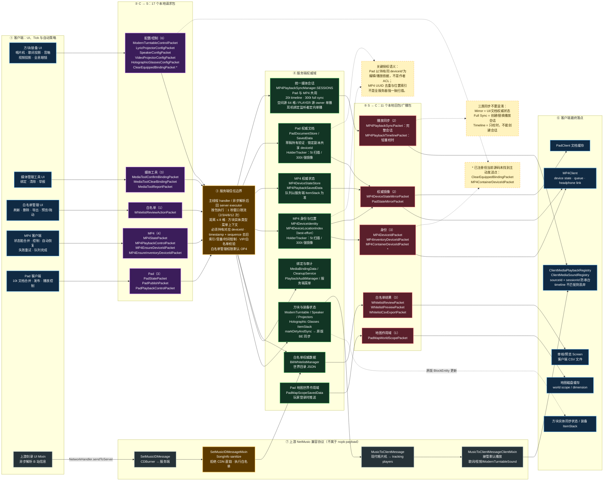

# NetMusicCanPlayBili 网络包全景图

> 当前协议：NeoForge payload registrar `1`，短命名空间 `ncpb`。共 **28 个本地 payload**（17 C→S、11 S→C），另有上游 NetMusic 的刻录/播放兼容消息链。

## 读图顺序

从左向右看：客户端行为产生 C→S payload，经服务端信任边界验证后修改权威状态；服务端再通过身份回包、状态镜像、完整播放同步、轻量时间轴或管理结果回到客户端。MP4 与 Pad 的数据模型彼此独立，但两者最终共用同一套媒体会话同步与客户端播放器。

图中 `*` 表示包已注册且 handler 完整，但当前源码没有发现主动发送点。方块实体常规数据使用 Minecraft 原生 BlockEntity 同步，不会额外占用一个 `ncpb` payload。刻录和现代唱片机播放还复用了上游 NetMusic 消息，因此单独画在最下方。
