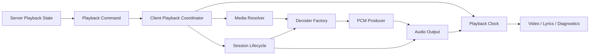

# 播放系统现代化审计

## 目标

播放系统应以一个明确的客户端播放会话为中心，而不是由网络消息、方块实体、声音实例、HTTP handler 和 OpenAL registry 分别推断当前状态。服务端仍是播放意图和全局时间的权威来源；客户端会话控制器负责把一次播放转换为可取消、可观测、可原子替换的本地生命周期。

## 当前端到端链路

1. `ModernTurntableBlockEntity` 解析唱片、保存播放状态并发送带 `PlaybackSync` fragment 的 `MusicToClientMessage`。
2. `MusicToClientMessageClientMixin` 只把第三方网络消息冻结为 `ClientPlaybackCommand`；`ModernTurntablePlaybackCoordinator` 统一编排现代唱片机和普通 B站兼容播放。
3. `MusicPlayManager` 创建 `ModernTurntableSound`，Minecraft 声音引擎异步调用 `SyncedMediaSound.getStream`。
4. `HttpAudioStreamHandler` 通过唯一 `nmb_request` token 一次性消费强类型 `PlaybackRequest`，选择 fMP4/EC-3、FLAC、AAC、MP3 或 NetEase fallback；媒体 URL 本身不再承载播放身份。
5. 解码后的 PCM 通过 `OpenALTappedAudioInputStream` 喂入 `StereoOpenALHandler`，或由 Dolby pipeline 直接喂入 `DolbyAudioHandler`。
6. `ClientAudioOutputRegistry` 只保存和驱动实现 `AudioOutputHandle` 的 OpenAL 输出；世界状态、session 有效性和 pacing 由 `ClientAudioOutputPolicy` 提供。
7. `PlaybackClock` 是歌词、视频、声音和诊断的统一时间入口，内部由 `ModernTurntableTimeline` 将服务端时间、平滑本地时钟和 OpenAL 可听位置组合为媒体、视觉和 pacing 三种时间。
8. `ModernTurntableSound` 负责结束判断、歌词、粒子、断链恢复和无进展 watchdog。

## 主要结构性问题

### 多个 session 真源

- 网络消息携带完整 session，包括 seek generation。
- 方块实体曾根据位置和 `startedGameTime` 重建 session，但未同步 `seekGeneration`。
- tracker、声音实例、HTTP context 和 OpenAL entry 又各自保存 session。

结果是输出层不得不比较或猜测字符串，容易把刚创建的新流当成旧流销毁。第一阶段已经改为：网络入口登记的 tracker session 是客户端生命周期权威值；方块实体完整同步 generation，只负责服务端状态和时间观测。

### 入口职责过载

`MusicToClientMessageClientMixin` 同时承担协议适配和业务编排。Mixin 应只把第三方消息转换成内部命令，然后交给普通 Java 类处理，以便测试和演进。

### 声音实例职责过载

`ModernTurntableSound` 同时是 Minecraft 声音对象、播放会话、恢复控制器、watchdog、歌词控制器和视觉粒子发射器。恢复或 stop 的任一分支都可能跨模块清理其他资源。

### registry 同时管理身份与设备

`ClientAudioOutputRegistry` 既决定哪个 session 当前有效，又管理 Dolby/Stereo 互斥、空间位置、音量、relay、容量限制、时间线和清理线程。设备 registry 应只管理输出句柄；会话替换应由更高层原子完成。

### URL fragment 与 side-channel 双重上下文

`PlaybackSync` fragment 和 `HttpAudioStreamHandler.ALLOWED_URLS` 曾同时传递 session/offset。阶段 3 已删除 URL FIFO、`allowUrl(...)` 和旧 `PlaybackContext`，现代播放为每次 stream request 生成唯一 `nmb_request` token，并通过一次性 registry 精确消费强类型 `PlaybackRequest`。URL 现在只表示媒体资源地址和 opaque transport token。

### 时间线层级过多

当前至少存在服务端 tick、`MediaTimelineClock`、OpenAL audible/fed、声音 tick、启动补偿 offset 和视觉 smoother。三种公开时钟是合理的，但应全部由单一 `PlaybackClock` 聚合，调用方不应自行 fallback 到 `startOffset + tick * 50`。

## 目标架构

建议引入以下强类型边界：

- `PlaybackSessionId`：不再由业务层解析字符串后缀。
- `PlaybackCommand`：包含 source、session、elapsed、duration、anchor、音量和播放意图。
- `ClientPlaybackCoordinator`：每个 source key 只持有一个 `PlaybackSession`，通过 compare-and-replace 原子换代。
- `PlaybackSession`：拥有 cancellation token、resolver future、decoder、output handle、clock 和恢复策略。
- `DecodedAudioSource`：统一 MP3/FLAC/AAC/E-AC-3 的 PCM/多声道输出契约。
- `AudioOutputHandle`：封装 Stereo/Dolby，registry 只跟踪 handle，不判断 session 是否陈旧。
- `PlaybackClock`：集中输出 server、pacing、audible、visual 时间。

## 分阶段迁移

### 阶段 1：收敛身份与协议

- 完整同步 `seekGeneration`。
- 以网络入口 tracker session 作为客户端当前会话真源。
- 将 session 比较集中到一个强类型值对象。
- 为 start、seek、repeat、retry 和 stop 增加状态转换测试。

### 阶段 2：抽出客户端协调器

- [x] Mixin 只构造 `ClientPlaybackCommand` 并转交现代唱片机播放。
- [x] 把 `tryStart`、prepare、allow URL、视频同步、歌词启动和声音创建移入 coordinator。
- [x] 将网络消息冻结为不依赖 Minecraft 运行时类型的不可变命令快照。
- [x] 所有现代唱片机命令在 Minecraft 客户端线程串行执行。
- [x] coordinator/tracker 引入显式 `ClientPlaybackSession` 和 cancellation token，原子登记新 session 后取消旧资源。
- [x] 会话使用 `PREPARING`、`BUFFERING`、`PLAYING`、`RECOVERING`、`STOPPING`、`STOPPED`、`FAILED` 状态机。
- [x] 流失败、正常结束、重复取消和后绑定资源均执行幂等清理。
- [x] 将普通 B站兼容播放也迁出 Mixin。

### 阶段 3：统一流创建

- [x] 现代播放用唯一 request token 取代按 stripped URL 排队消费 context，同 URL 请求可反序到达且不会串 session。
- [x] request token 一次性消费，支持 TTL、显式取消，并绑定到 `ClientPlaybackSession` cancellation。
- [x] 删除 `ALLOWED_URLS`、`allowUrl(...)` 和旧 `PlaybackContext`，统一使用显式 `PlaybackRequest`。
- [x] MP3 从文件头建立解码状态，在 PCM 域按完整 frame 对齐丢弃起播偏移，避免 Layer III bit reservoir 导致中途起播白噪音。
- [x] fMP4 decoder factory 返回强类型 `Supported` / `Unsupported` 结果，handler 不再直接按 codec 构造 pipeline。
- [x] 将 MP3 从头解码、PCM seek 和启动延迟补偿抽取为独立 `PcmStartupSeekPolicy`。
- [x] 容器探测层返回 `FMP4`、`RAW_EAC3`、`OTHER_AUDIO` 强类型结果；普通音频 fallback 不再解析异常消息，也不增加额外网络请求。

### CDN 请求降压

- [x] 默认关闭 playurl CDN 首包竞速和音频小 Range 竞速，保留 JVM 属性显式开启能力。
- [x] 403 使用专用 host 冷却，冷却期内优先选择其它 host，且不在同 host 重试。
- [x] Range 预取只保留一层 CDN fallback，避免内外两层重试放大请求。
- [x] CDN fallback 按近期健康分数排序；全部 host 冷却时只尝试最早恢复的单个兜底 host。
- [x] 只有在完整读取并校验 Range body 后才记录成功，空包、短读和错误 Content-Range 不再提前判定为成功。

### 阶段 4：简化输出和时间线

- [x] Stereo/Dolby 实现统一 `AudioOutputHandle`，公共停止和清理路径只依赖该契约。
- [x] registry 移除直接的方块实体访问和 session 换代职责；相关观测策略迁入 `ClientAudioOutputPolicy`。
- [x] `PlaybackClock` 成为歌词、视频、watchdog 和诊断唯一时间读取 API。
- [x] Stereo/Dolby 合并为单一 `AudioOutputHandle` store；Dolby 的 channel mask、静态 JOC 和诊断描述通过专属 capability 分支保留。

### 阶段 5：统一恢复和清理

- [x] 每个 session 使用一个 cancellation token 和显式状态机：`PREPARING`、`BUFFERING`、`PLAYING`、`RECOVERING`、`STOPPING`、`STOPPED`、`FAILED`。
- [x] 完整结束和恢复退役分别由 coordinator 的单一语义入口执行，声音对象不再串联多个 registry。
- [x] anchor、video、diagnostics、lyric、request token、sound 和 recovery registration 在创建时绑定到 session cancellation token；完整结束只取消 session。

## 后续可选深化

- 引入 `PlaybackSessionId` 值对象，进一步消除 session、request token 和 transport generation 都使用裸字符串的误传风险。
- 评估以 `DecodedAudioSource` 统一“返回 PCM stream”和“pipeline 直接驱动 OpenAL”两种输出模式；应复用现有 `AudioDecodePipeline`，避免重复抽象。
- [x] 容器分类、同 URL request token 反序隔离、session 并发幂等取消、PCM seek frame 对齐和单一输出 store 的替换/容量/并发行为已有纯 Java 自动化测试。
- 连续 seek、retry generation、真实 OpenAL source 换代和世界切换仍属于客户端集成验证，不应以 mock 单元测试代替。

## 验证门槛

### 自动化已覆盖

- [x] 同一媒体 URL 的多个 request token 可反序消费且不串 context；token 一次消费、过期和取消均已验证。
- [x] session 多线程取消只有一个成功调用，资源恰好清理一次；取消期间后绑定资源和异常清理动作均已验证。
- [x] fMP4、raw E-AC-3、普通音频分类，以及截断/非法 fMP4 不误 fallback 已验证。
- [x] PCM 固定偏移按完整 frame 消费，零偏移和短流边界已验证。
- [x] 单一输出 store 的同 key 原子替换、最旧淘汰、相同时间顺序、身份条件删除和并发替换已验证。

### 仍需客户端集成验证

- [ ] start 后立即 seek 不会让旧输出读取新时间线。
- [ ] 连续多次 seek 只保留最后一个 session 的 decoder 和 OpenAL source。
- [ ] 从 MP3 任意时间点启动不产生白噪音，且启动延迟可观测。
- [ ] retry 不改变媒体身份，只替换同一 session 的传输 generation。
- [ ] 切世界、取出唱片、静音和超距停止均执行一次且仅一次 OpenAL/native 清理。